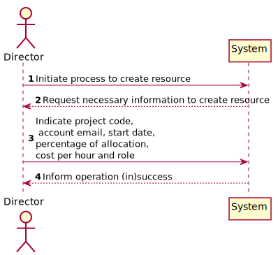
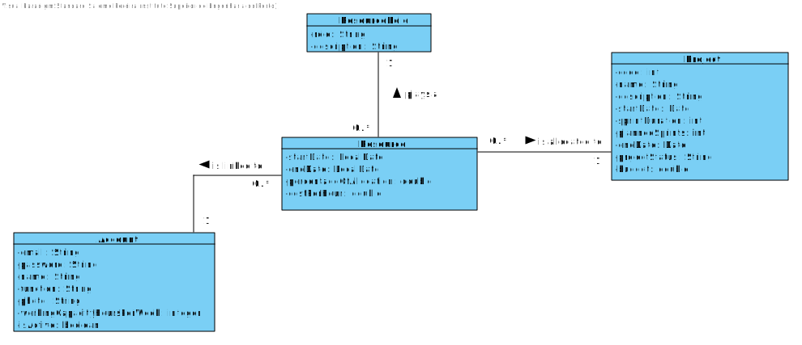
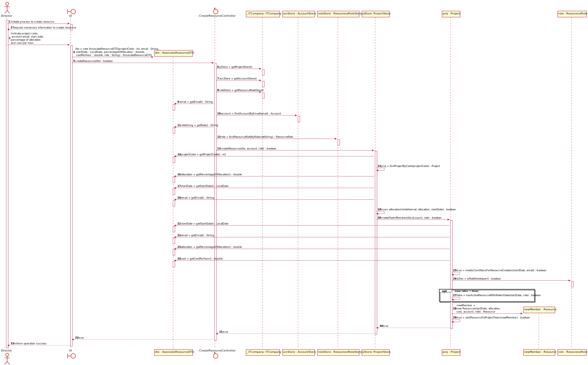
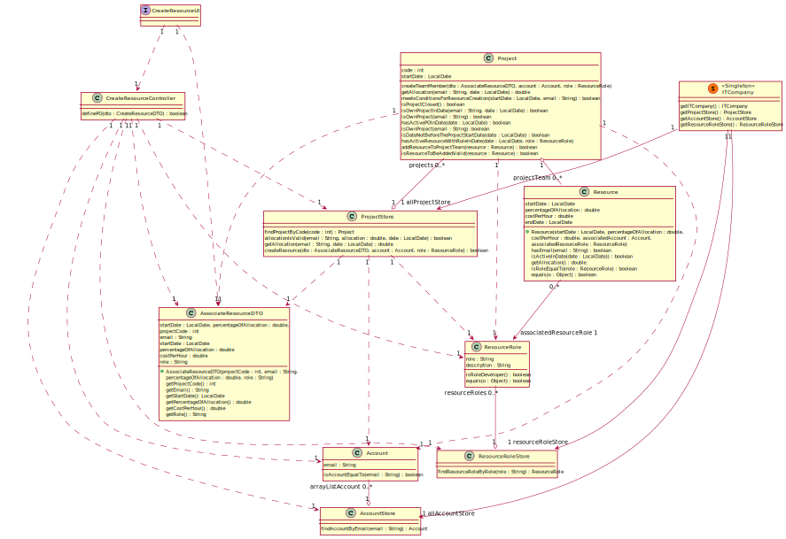

# US 007 - To Associate a Resource to a Project

## 1. Requirements Engineering

### 1.1. User Story Description

- As Director, I want to associate a human resource (user) to a project.

### 1.2. Customer Specifications and Clarifications

**From the specifications document:**
> "The project timeline is divided into sprints (multiple of weeks), typically of the predefined
>duration, and the project team, PO and SM don’t change during the sprint" (v3, p4, l 1-2)

>"The director should have the ability to associate resources with projects. This association can
> be made at the time of project creation or before each sprint. It is a scrum best practice that
> no resource should be allocated to more than a project at a given time, so that developers are
> focused on the tasks in hand. But this may not be feasible for specific technical and/or short
> duration tasks." (v 3, p 5, l 5-9)

> "When associating a resource with a project, the following information should be specified:
> * Start date;
> * End date;
> * Cost per hour (monetary value that the resource costs for each hour used in the project);
> * Percentage of allocation (100% for full-time, or the percentage corresponding to part-time);" (v3, p5, l 10-16)

> "The system should ensure that at no time (i.e. week) is a resource associated with an allocation
>of more than 100% in different projects." (v 3, p 5, l 17-19)

**From the Product Owner clarifications:**

>  **Question:** According to the specifications document, the PO, as well as other team members,
> should not change during a sprint. However, during the last sprint review, it was noted by the POs
> that this might be too restrictive, since due to an unforeseen situation, it might be necessary to replace
> a human resource at any time. For our project, and specifically for US27, the date a PO initiates functions
> might be any day date after the project start, or should necessarily coincide with the begining date of a sprint?
> (G6, 28/01)
>
> **Answer:** The PO might be changed at any time. (AMM, 31/01)

### 1.3. Acceptance Criteria  
**AC1:** _OK_ It shall not be possible to create duplicated resources for a given project. - this is ensured by AC3  
**AC2:** _OK_ Resources can only be allocated to projects that are not yet finalized.   
**AC3:** _OK_ A person cannot accumulate roles in the same project at the same time.  
**AC4:** _OK_ There must only be one active PO/SM/PM in a team at any time.  
**AC5:** _OK_ The cumulated percentage of allocation of a worker in all projects in which he/she participates cannot exceed 100.  
**AC6:** _OK_ Resource start and end dates must be coherent with project start and end dates (check observations section).  
**AC7:** _OK_ The percentage of allocation entered by the director must be a positive number lower than 100.   
**AC8:** _OK_ The cost per hour entered by the director must be a positive number.  
**AC9:** _OK_ It must not be possible to terminate a resource before its Start Date.  
**AC10:** _OK_ A resource cannot start nor terminate their functions while a Sprint is running. This means, on the day indicated  
by the Director to start the resource allocation, there can't be any Sprint running. Similarly, if that StartDate is changed,   
the same must be checked. When the resource is terminated, i.e., an end date is set, there can't be any sprint running either.   
Note that this check is only done for resources that have the role of Developer or Scrum Master, because only the   
development team can't change during the Sprint. The PMs and POs do not have this limitation and can be allocated or terminated  
at any time, as long as respecting the remaining business rules.   
  
### 1.4. Found out Dependencies  
  
* In order to select necessary data, the Director must know the projects, user accounts and available roles. Therefore,   
    * there is a dependency of US015 - As Director, I want to get a list of all projects. Or better, a list of projects that are not closed;  
    * there is a dependency of US024 - As Administrator, I want to get a list all user accounts and their status.  
  
### 1.5 Input and Output Data

**Input Data:** 

* Selected data:
    * Project in which to allocate resource
    * Email of the user account to be allocated as resource
    * Role of the resource 
    
* Typed data:
    * Start date of the resource functions
    * Percentage of allocation
    * Cost per hour of the resource
    
**Output Data:**

* (In)Success of the operation

### 1.6. System Sequence Diagram (SSD)

## 2. OO Analysis

### 2.1. Relevant Domain Model Excerpt

### 2.2. Other Remarks

n/a

## 3. Design - User Story Realization

### 3.1. Rationale

### Systematization ##

According to the taken rationale, the conceptual classes promoted to software classes are:

* Account
* Resource
* Project
* ResourceRole

Other software classes (i.e. Pure Fabrication) identified:

* CreateResourceUI
* CreateResourceController
* ITCompany
* AccountStore
* ProjectStore
* ResourceRoleStore
* AssociateResourceDTO
* ResourceList - this is a class that comprises the project's team and it is needed to implement business rules (resource allocation validations)

## 3.2. Sequence Diagram (SD)
**Main success case**

## 3.3. Class Diagram (CD)

# 4. Tests

**Test 1:** Success case

	 @Test
    void createResourceSuccessTest() {
    ...
    assertTrue(result);
    }

**Test 2:** Insuccess case: role is not developer and there is an active resource with the same role

    @Test
    public void createResourceFailRoleIsUniqueAndTaken() {
    ...
    assertFalse(result);
    }

**Test 3:** Insuccess case: Status of the project is closed.
        
    @Test
    public void createResourceFailProjectIsClosed() {
    ...
    assertFalse(result);
    }
  
**Test 4:** Insuccess case: Appointed person does not have enough working capacity.

	 @Test
    void createResourceFailExceedsAllocationTest() {
    ...
    assertFalse(result);
    }

**Test 5:** Insuccess case: appointed person already plays another role in the project team.

	 @Test
    public void createResourceFailIsAlreadyInTheProjectTeam() {
    ...
    assertFalse(result);
    }
    
**Test 6:** Insuccess case: appointed start date is invalid.

	 @Test
    public void createResourceFailInvalidDate() {
    ...
    assertFalse(result);
    }

# 5. Observations
Design pattern: creator
The concept of Resource only exists in the context of a project. Hence, it makes no sense to have a class "ResourceStore"
that includes all the resources of the ITCompany. Since we abandon this pattern, we had to find an alternative for the 
class which would create the object Resource, the Creator.
The class Resource List has been promoted to software class, because there are several business rules to be 
implemented in the context of a project team (list of resources of a given project).
Moreover, it knows all the resources of a given project and therefore it is well positioned to become the creator of 
resources. This way, we are also relieving this responsibility burden from the class Project (the second candidate
to being a creator), since it already comprises many other different responsibilities. 

Vulnerabilities and improvement suggestions for the solution implemented:
* The director might want to know details about the account holder's total working capacity and availability before
selecting a user to be allocated. This may involve creating a DTO that together with the user email and status shows the user available 
capacity along time. This may be a good improvement suggestion for the future. 
* The new method CreateResource on class ResourceList includes a method to add the new Resource to the Resource List.
Therefore, the method "addResourceToProjectTeam" available on class Project is useless and not according to
the new design. It was marked as deprecated and will be fixed later, as it currently has about 150 dependent tests
which represents a big workload. 
* Based on the new design of US007, US027 may need to be revised. 
* In the future, we will need to implement a feature for project closure, which may imply terminating the resources
still active in that project.
* Considering that the Sprints' dates may be changed, the resources allocated to projects may also need to change their 
allocation dates accordingly. This is a feature to be implemented in the future. 

