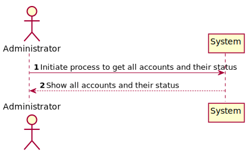
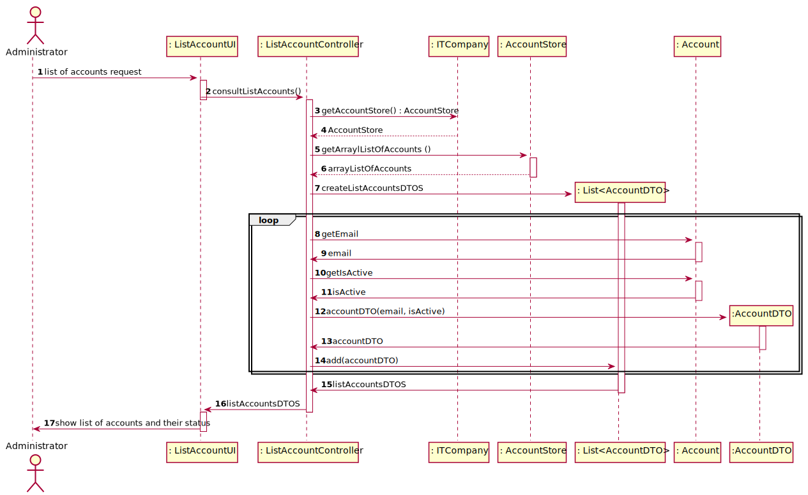
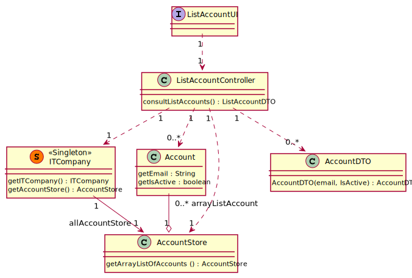

# US 24 - To list categories

## 1. Requirements Engineering

### 1.1. User Story Description

As Administrator, I want to get a list all user accounts and their status.

### 1.2. Customer Specifications and Clarifications

**From the specifications document:**

> When you create a new record, it is created as inactive. At the same time an 
> e-mail message is sent to the user that will allow them to activate the account, through a code 
> or an automatic activation link.

**From the client clarifications:**

> **Question:** The list has to contain only email and status (active/inactive)?
>
> **Answer:** "Email and status are enough, for now."

### 1.3. Acceptance Criteria

* Not-Provided
* No implicit AC were found

### 1.4. Found out Dependencies

* No dependencies were found.

### 1.5 Input and Output Data

**Input Data:**

* Typed data:
    * n/a

* Selected data:
    * n/a

**Output Data:**

* (In)Success of the operation

### 1.6. System Sequence Diagram (SSD)

### 1.7 Other Relevant Remarks

* n/a

## 2. OO Analysis

### 2.1. Relevant Domain Model Excerpt

### 2.2. Other Remarks

n/a

## 3. Design - User Story Realization

### 3.1. Rationale

| Interaction ID | Question: Which class is responsible for... | Answer  | Justification (with patterns)  |
|:-------------  |:--------------------- |:------------|:---------------------------- |
| Step 1  		 |	... interacting with the actor? | ListAccounUI  |  Pure Fabrication: there is no reason to assign this responsibility to any existing class in the Domain Model.           |
| Step 2	  	 |	... coordinating the US? | ListAccountController | Controller                             |
| Step 3	  	 |	... knows all existing accounts? | AccountStore   | IE: contains all existing Accounts  |
| Step 4	     |	... create list of AccountsDTOS  | List<AccountDTO>  | Creator   |
| Step 5	  	 | ... knows the attributes of each account?   | Account  | IE: contains all information about each account  |
| Step 6		 | ... knows each necessary account data (email and status)   | AccountDto  | IE: Each AccountDto knows its own account data (email and status)  |
| Step 7     	 |	... informing operation success | ListAccountUI            |  IE: is responsible for user interactions.    |

### Systematization ##

According to the taken rationale, the conceptual classes promoted to software classes are:

* Account

Other software classes (i.e. Pure Fabrication) identified:
* ListAccountUI
* ListAccountController
* ITCompany
* AccountStore

## 3.2. Sequence Diagram (SD)

## 3.3. Class Diagram (CD)

# 6. Observations

n/a

