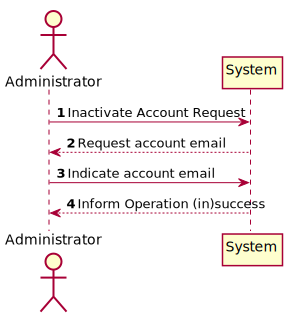
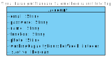
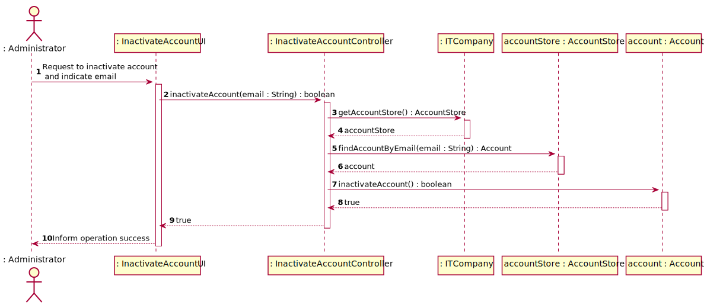
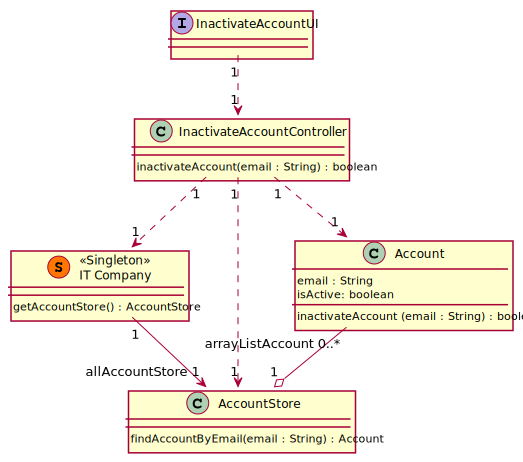

# US 25 - To inactivate an account

## 1. Requirements Engineering

### 1.1. User Story Description

US026 - As Administrator, I want to inactivate a user account

### 1.2. Customer Specifications and Clarifications

**From the specifications document:**

> "When you create a new record, it is created as inactive. At the same time an
> e-mail message is sent to the user that will allow them to activate the account, through a code
> or an automatic activation link."(v3, p7, l3)

**From the Product Owner clarifications:**

> **Question:** A user that is on a list of resources of one or many projects, might have their acount inactivated? (G4, 30/01)
>
> **Answer:** Yes, without any other implication on the system.
(AMM, 31/01)

### 1.3. Acceptance Criteria

* **AC1** To inactivate account, it has to be inactive;
* No implicit AC were found

### 1.4. Found out Dependencies

* No dependencies were found.

### 1.5 Input and Output Data

**Input Data:**

* Selected data:
    * Email of the account to inactivate

**Output Data:**

* (In)success of the operation

### 1.6. System Sequence Diagram (SSD)

### 1.7 Other Relevant Remarks

* n/a

## 2. OO Analysis

### 2.1. Relevant Domain Model Excerpt

### 2.2. Other Remarks

n/a

## 3. Design - User Story Realization

### 3.1. Rationale

| Interaction ID | Question: Which class is responsible for... | Answer  | Justification (with patterns)  |
|:-------------  |:--------------------- |:------------|:---------------------------- |
| Step 1 / 2 		 |	... interacting with the actor? | InactivateAccountUI   |  Pure Fabrication: there is no reason to assign this responsibility to any existing class in the Domain Model.           |
|  	 Step 3 	 |	... coordinating the US? | InactivateAccountController | Controller                             |
| 		 |	... find the selected account? | AccountStore   | IE: Contains all existing Accounts |
|		 |	... inactivate account?            | Account   | IE: Knows it's own data |
|  Step 4   		 | ... informing operation success?|  InactivateAccountUI  |	IE: is responsible for user interactions.

### Systematization ##

According to the taken rationale, the conceptual classes promoted to software classes are:

* Account

Other software classes (i.e. Pure Fabrication) identified:
* InactivateAccountUI
* InactivateAccountController
* ITCompany
* AccountStore

## 3.2. Sequence Diagram (SD)

**Main Success Scenario**

## 3.3. Class Diagram (CD)

# 4. Tests

Two relevant test scenarios are highlighted next.

**Test 1:** Inactivating an active account

     @Test
    void inactivateAccountSuccess() {
        AccountStore store = ITCompany.getITCompany().getAccountStore();
        Account lino = store.createNewAccount("lino@isep.ipp.pt", "1234", "Lino", "Developer", "photo");
        store.addNewAccount(lino);
        lino.activateAccount();
        InactivateAccountController controller = new InactivateAccountController();

        boolean result =controller.inactivateAccount("lino@isep.ipp.pt");

        assertTrue(result);

**Test 2:** Inactivating an account that is already inactive

    @Test
    void inactivateAccountInsuccess() {
        AccountStore store = ITCompany.getITCompany().getAccountStore();
        Account lino = store.createNewAccount("lino@isep.ipp.pt", "1234", "Lino", "Developer", "photo");
        store.addNewAccount(lino);
        InactivateAccountController controller = new InactivateAccountController();

        boolean result =controller.inactivateAccount("lino@isep.ipp.pt");

        assertFalse(result);

