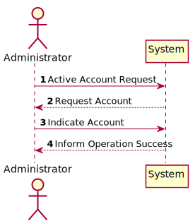
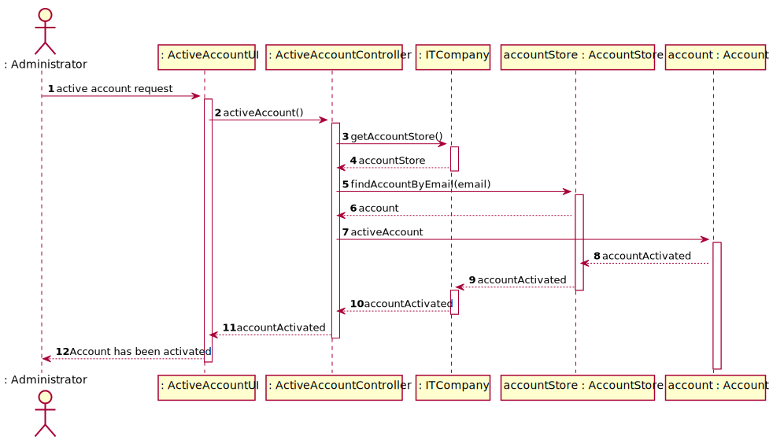
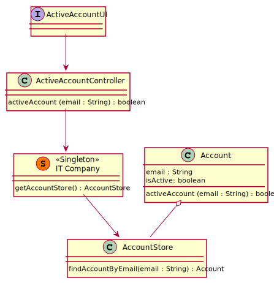

# US 26 - To activate an account

## 1. Requirements Engineering

### 1.1. User Story Description

US026 - As Administrator, I want to activate a user account

### 1.2. Customer Specifications and Clarifications

**From the specifications document:**

> When you create a new record, it is created as inactive. At the same time an
> e-mail message is sent to the user that will allow them to activate the account, through a code
> or an automatic activation link.

**From the client clarifications:**

> n/a

### 1.3. Acceptance Criteria

* **AC1** To active account, it must to be inactive;
* No implicit AC were found

### 1.4. Found out Dependencies

* No dependencies were found.

### 1.5 Input and Output Data

**Input Data:**

* Typed data:
    * Email to find account that administrator wants active

* Selected data:
    * n/a

**Output Data:**

* List of accounts and their status.

### 1.6. System Sequence Diagram (SSD)

### 1.7 Other Relevant Remarks

* n/a

## 2. OO Analysis

### 2.1. Relevant Domain Model Excerpt

### 2.2. Other Remarks

n/a

## 3. Design - User Story Realization

### 3.1. Rationale

| Interaction ID | Question: Which class is responsible for... | Answer  | Justification (with patterns)  |
|:-------------  |:--------------------- |:------------|:---------------------------- |
| Step 1  		 |	... interacting with the actor? | ActiveAccountUI   |  Pure Fabrication: there is no reason to assign this responsibility to any existing class in the Domain Model.           |
| Step 2  		 |	... coordinating the US? | ActiveController | Controller                             |
| Step 3  		 |	... find the selected account? | AccountStore   | IE: Contains all existing Accounts |
| Step 4 		 |	... active account?            | Account   | IE: Knows all Account attributes |
| Step 5  		 | ... informing operation success?| ActiveAccountUI  |	IE: is responsible for user interactions.

### Systematization ##

According to the taken rationale, the conceptual classes promoted to software classes are:

* Account

Other software classes (i.e. Pure Fabrication) identified:
* ActiveAccountUI
* ActiveAccountController
* ITCompany
* AccountStore

## 3.2. Sequence Diagram (SD)

**Doubts:**

* Does it make any sense the UI (View) accessing directly our domain objects (i.e. Category)?
* What are the risks of doing that?
* Is there a way to prevent such thing of happening?

## 3.3. Class Diagram (CD)

**Note: private attributes and/or methods were omitted.**

# 4. Tests

Two relevant test scenarios are highlighted next.
Other test were also specified.

**Test 1:** Getting all existing categories when no one exists.

     TEST_F(CategoryContainerFixture, GetAllWhenEmpty){
        EXPECT_TRUE(this->container->isEmpty());
        list<shared_ptr<Category>> list = this->container->getAll();
        EXPECT_TRUE(list.empty());
    }

**Test 2:** Getting all existing categories when several exists.

    TEST_F(CategoryContainerFixture, GetAllWhenPopulated){
        this->populateWithFourCategories();
        list<shared_ptr<Category>> list = this->container->getAll();
        EXPECT_EQ(list.size(), 4);
    }

# 5. Integration and Demo

A menu option on the console application was added. Such option invokes the ListCategoryView.

    int CategoriesMenuView::processMenuOption(int option) {
        int result = 0;
        BaseView * view;
        switch (option) {
          ...
          case 2:
            view = new ListCategoryView(this->userToken);
            view->show();
            break;
          ...
        }
        return result;
    }

# 6. Observations

n/a
