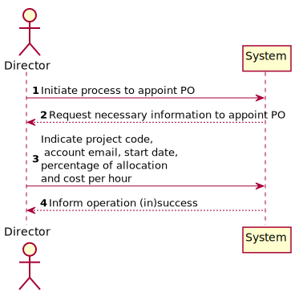
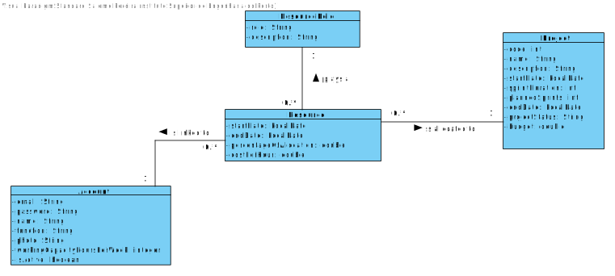
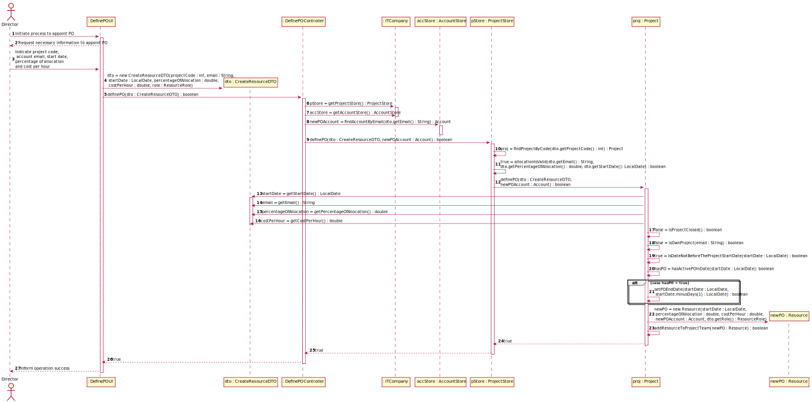

# US 026 - To Define the Product Owner of a Project 

## 1. Requirements Engineering

### 1.1. User Story Description

- As Director, I want to define the PO of a project

### 1.2. Customer Specifications and Clarifications 

**From the specifications document:**

>"(...)the project team, PO and SM don’t change during the sprint."(v3, p4, l2)
>
**From the Product Owner clarifications:**
> **Question:** To define the PO of a project, should we select someone from the team,
> or do we add a new member? (G6, 25/01)
>
> **Answer:** The Director appoints someone.
> Does not have to be someone previously attached to the team, on the contrary. (27 jan via MSTeams)
> 

> **Question:** According to the specifications document, the PO, as well as other team members, 
> should not change during a sprint. However, during the last sprint review, it was noted by the POs 
> that this might be too restrictive, since due to an unforeseen situation, it might be necessary to replace
> a human resource at any time. For our project, and specifically for US27, the date a PO initiates functions
> might be any day date after the project start, or should necessarily coincide with the begining date of a sprint?
> (G6, 28/01)
>
> **Answer:** The PO might be changed at any time. (AMM, 31/01)

### 1.3. Acceptance Criteria

* **AC1:** The resource to appoint as PO must not be a member of the team.
* **AC2:** The cumulated percentage of allocation of a worker in all projects in which he/she participates cannot exceed 100
* **AC3:** There must only be one active PO in a team at any time.
* **AC4:** The Product Owner role cannot be cumulated with other roles within the project.
* **AC5:** Resources can only be allocated to projects that are not yet finalized.

### 1.4. Found out Dependencies

* No dependencies found

### 1.5 Input and Output Data

**Input Data:**
	
* Selected data:
    * Project to appoint PO
    * Email of the resource to appoint as PO

* Typed data:
  * Start date of the PO functions
  * Percentage of allocation
  * Cost per hour of the resource

**Output Data:**

* (In)Success of the operation

### 1.6. System Sequence Diagram (SSD)

## 2. OO Analysis

### 2.1. Relevant Domain Model Excerpt 

### 2.2. Other Remarks

n/a

## 3. Design - User Story Realization 

### 3.1. Rationale

| Interaction ID | Question: Which class is responsible for... | Answer  | Justification (with patterns)  |
|:-------------  |:--------------------- |:------------|:---------------------------- |
| Step 1 / 2 		  |	... interacting with the actor?     | UpdatePOUI   |  Pure Fabrication: there is no reason to assign this responsibility to any existing class in the Domain Model.           |
| 			  	 
| Step 3              |...instantiate dto? |UpdatePOUI| IE: knows user input data
|                     |	... coordinating the US? | UpdatePOController | Controller  
|                     |... find the selected account? | AccountStore  | IE: contains all existing Accounts  |
|                     | ... find the selected project? | ProjectStore  | IE: contains all existing Projects  | 
| 		  	          |	... determine if percentage of allocation is valid? | ProjectStore  | IE: contains all existing Projects, and each project its own resources and respective percentage of allocation |
| 		  	          |	... determine if project is closed? | Project  | IE: knows its own state |
|                     |	... determine if indicated user already plays a role in the team? | Project  | IE: knows its own resources |
|                     |	... validate start date? | Project  | IE: knows its own state |
|                     |	... know if there is an active PO? | Project  | IE: knows its Resources |
|                     |	... set end date of PO resource? | Project  | IE: knows its Resources |
|                     |	... create a new Resource? | Project  | Creator:  Project aggregates resources in its team |
| 			  	      |	...saving the new Resource?						 | Project  | IE: knows its Resources |
|  Step 4             |	... informing operation success?| UpdatePOUI   | IE: is responsible for user interactions.  |
|

### Systematization ##

According to the taken rationale, the conceptual classes promoted to software classes are: 

 * Account
 * Resource
 * Project

Other software classes (i.e. Pure Fabrication) identified: 

 * UpdatePOUI  
 * UpdatePOController
 * ITCompany
 * AccountStore
 * ProjectStore

## 3.2. Sequence Diagram (SD)
**Main success case**

## 3.3. Class Diagram (CD)

# 4. Tests

**Test 1:** Success case: Project does not have Product Owner yet.

	 @Test
    void definePOSuccessProjectDoesNotHavePOTest() {
    ...
    assertTrue(result);
    }

**Test 2:** Success case: Project does not have Product Owner at the date appointed for the new PO to start functions

	@Test
    void definePOSuccessProjectHasInactivePOTest() { 
    ...
    assertTrue(result);
    }
**Test 3:** Success case: at specified date, project already has a Product Owner.

	@Test
    void definePOSuccessProjectHasPOTest() {
    ...
    assertTrue(result);}

**Test 4:** Insuccess case: Status of the project is closed and end date is defined.

	@Test
    void definePOInsuccessProjectClosedTest() {
    ...
    assertFalse(result);}

**Test 5:** Insuccess case: Appointed person does not have enough working capacity.

	 @Test
    void definePOInsuccessExceedsAllocationTest() {
    ...
    assertFalse(result);}

**Test 6:** Insuccess case: appointed person already plays another role in the project team.

	@Test
    void definePOInsuccessResourceHasAnotherRoleInProjectTest() {
    ...
    assertFalse(result);}
**Test 7:** Insuccess case: appointed start date is invalid.

	 @Test
    void definePOInsuccessAppointedDateIsBeforeProjectStartTest() {
    ...
    assertFalse(result);}
# 5. Observations

The project has a design fault: a bidirectional association between Project and Resource.
This has proven to be problematic. We had to work around this issue during this sprint in order to accomplish the sprint goals in time.
It was not possible to correct this problem in the meanwhile,
however we intend to do it as soon as possible.

Project class has too many responsibilities, should we find ways to delegate these responsibilities in other classes, thus increasing cohesion?

Even though a Data Transfer Object should carry primitive types, a ResourceRole object 
is an immutable object that does not allow manipulation of its internal state
through instance methods. For this reason, we consider it is not very problematic to bring this object out of the domain layers

