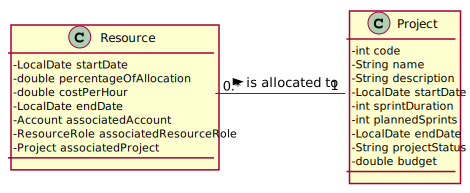

# US 028

## 1. Requirements Engineering

### 1.1. User Story Description

    As Director, I want to get a list of all human resources in a project.

### 1.2. Customer Specifications and Clarifications

**From the specifications document:**

    The Director is a profile that allows the user to have access to all projects (page 1, row 29).
    For the Director profile, information about the allocation of all users registered in the system
    should be listed. (page 5, row 29).

**From the client clarifications:**

    Question by Group 6(via Teams_25/01/2022_12:41): Do you want to see the active resources or all those who
    have already participated in the project? 
    Answer: All attached to the project.

### 1.3. Acceptance Criteria

    AC028-1 The project List can´t be empty.
    AC028-2 The list can´t be dupplicated.
    AC028-3 It is mandatory to insert a project code.
    Ac028-4 There must be resources allocated to the project.

### 1.4. Found out Dependencies
    
    This User Story is dependes on the realization of US015. 

### 1.5 Input and Output Data

    Input Data: Project code.
    Selected data: the project code.
    Output Data: returns all resources associated to a project.

## 2. OO Analysis

### 2.1. Relevant Domain Model Excerpt

## 3. Design - User Story Realization

### 3.1. Rationale

    n/a

### Systematization ##

    According to the taken rationale, the conceptual classes promoted to software classes are:

    Project
    Resource

    Other software classes (i.e. Pure Fabrication) identified: 
    SearchResourcesUI
    ListResourceInProjectController
    ITCompany
    ProjectStore
    ResourceMapper

## 3.2. Sequence Diagram (SD)

## 3.3. Class Diagram (CD)

