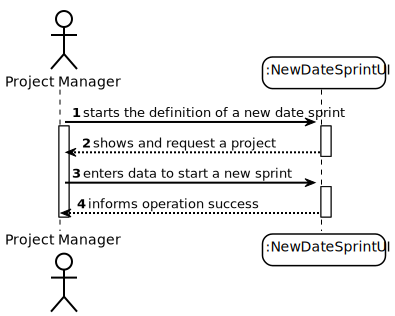
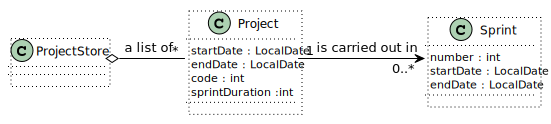
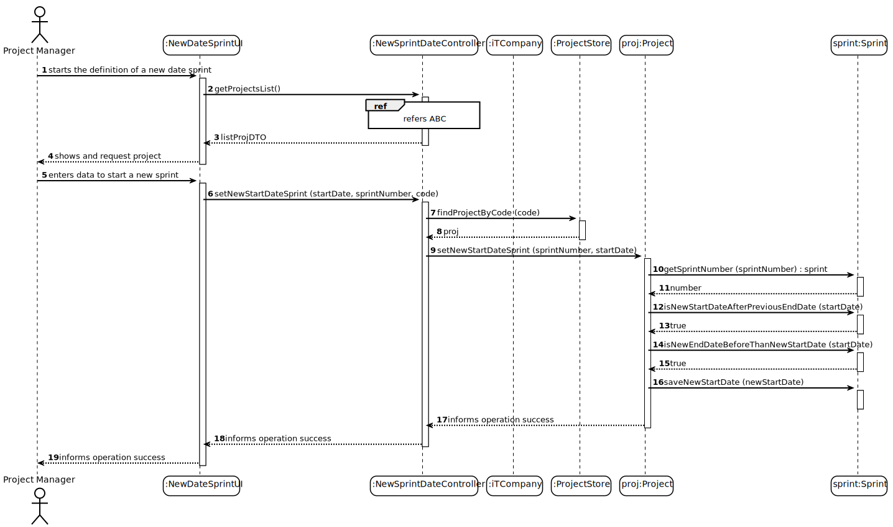
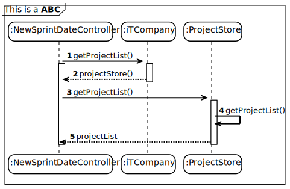
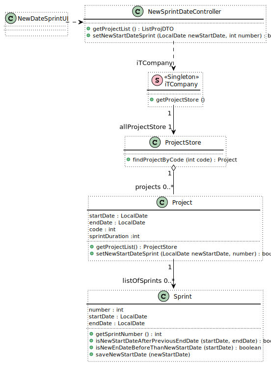

# US029 - As Project Manager, I want to start a sprint

## 1. Requirements Engineering

### 1.1. User Story Description

As a Project Manager, I want to initiate a sprint.

### 1.2. Customer Specifications and Clarifications

**From the specifications document:**

Each project must have at least the following information. Sprint duration (initial estimate), page 3 line 11, version 3
of Project_Switch;

Each project must have at least the following 4 information. Number of planned sprints, page 3 line 12, version 3 of
Project_Switch;

The project timeline is divided into sprints (multiple of weeks), typically of the predefined 1 duration, page 4 line 1
and 2, version 3 of Project_Switch;

Each sprint has a “sprint backlog”, i.e. the set of user stories that should be addressed during the sprint, page 4
line 3 and 4, version 3 of Project_Switch;

**From the client clarifications:**

**Question by Group6(via Teams_25/01/2022_12:41):** What does starting a sprint entail?
**Answer by PO Angelo Martins (via Teams_27/01/2022_13:44)**:** "The team can start working."

**Question by Group1 (via Teams_27/01/2022_12:33):** "Can you start a sprint on a different date at the start date
indicated at the time of creation of the sprint? If yes, will the date be changed to the date when the sprint
starts?"   
**Answer by PO Angelo Martins (via Teams_27/01/2022_13:44):** "Yes, it seems reasonable."

**Question by Group6 (via Teams_27/01/2022_19:35):**"Following on from the responses regarding US029, I wonder if by
changing the Start date we are "pushing" the Sprint to later? Or is it also possible to anticipate it? If we "push" it
later, will all subsequent Sprints also have to be "pushed" or "anticipated"? What happens if this start date change
causes a Sprint overlap?"  
**Answer by PO Angelo Martins (via Teams_27_01_2022_22:16):** "There can be no overlapping sprints, that’s obvious.
**Opinion of PO Angelo Martins:** "As for the "anticipation"/"postponement" of the sprints, the problem is in trying to
set starting dates for the sprints. Unlike Gannt/PERT type planning, sprints do not have scheduled dates, but only
succeed in time."

### 1.3. Acceptance Criteria

* AC029-1. Sprint cannot be empty.
* AC029-2. Sprint cannot be duplicate.
* AC029-3. Start date is after the last sprint.
* AC029-4. End date is later than start date.
* AC029-5. Duration of a sprint cannot be equal or under zero.
* AC029-6. Start date reference, duration, are mandatory. 

### 1.4. Found out Dependencies

* There is a dependency with [US022],since a  start date must be previously created in order to be updated.

### 1.5 Input and Output Data

**Input Data:**

* Typed data:
    * Start date
    * Duration

* Selected data:
    * The category to be updated

**Output Data:**

* List of Categories to be selected
* Success of the operation

### 1.6. System Sequence Diagram (SSD)

### 1.7 Other Relevant Remarks

* The start date of the sprint is changed.

## 2. OO Analysis

### 2.1. Relevant Domain Model Excerpt

### 2.2. Other Remarks

n/a

## 3. Design - User Story Realization

### 3.1. Rationale

n/a

### Systematization ##

According to the taken rationale, the conceptual classes promoted to software classes are:

* Project Manager
* Project
* Sprint

Other software classes (i.e. Pure Fabrication) identified:

* NewDataUI
* NewDataController
* iTCompany
* ProjectStore

## 3.2. Sequence Diagram (SD)

## 3.3. Class Diagram (CD)

**Note: private attributes and/or methods were omitted.**
  
