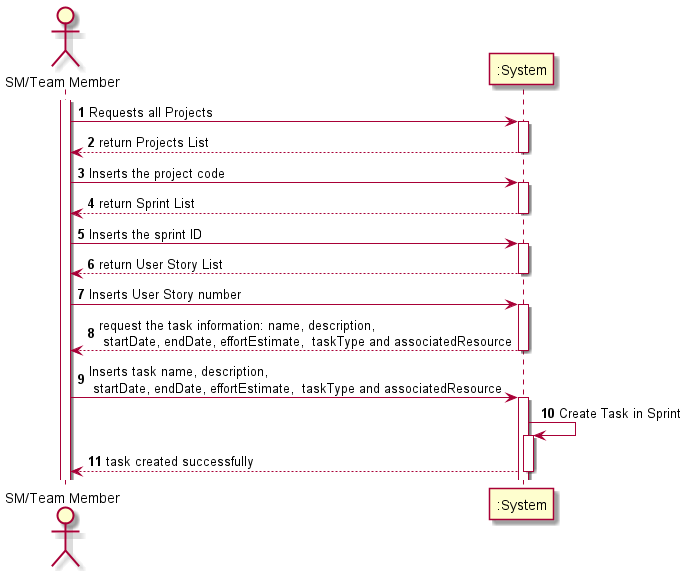
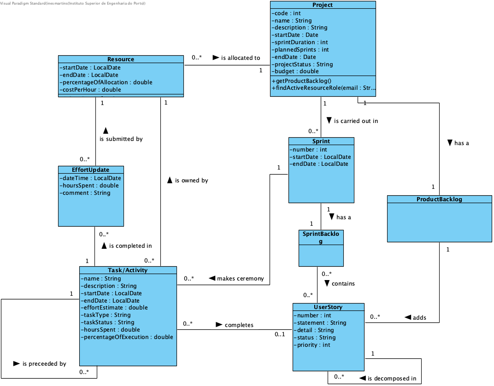
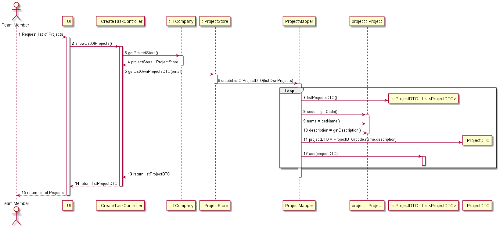
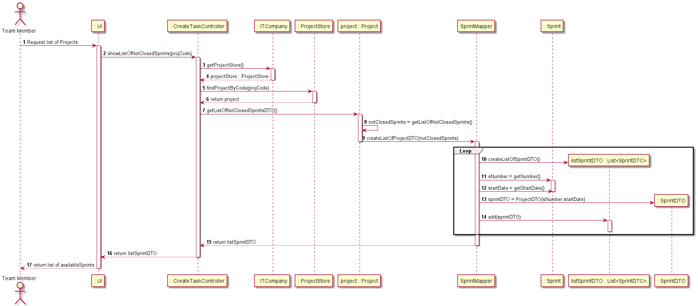
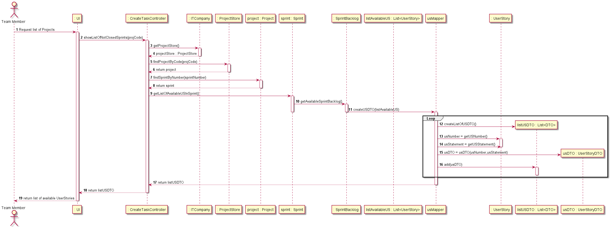
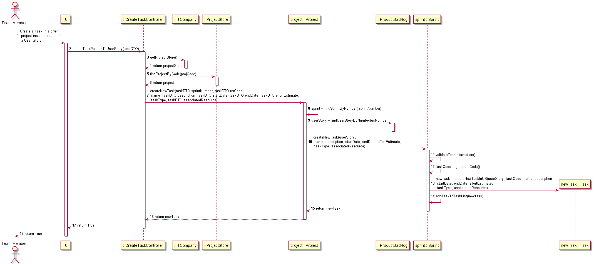
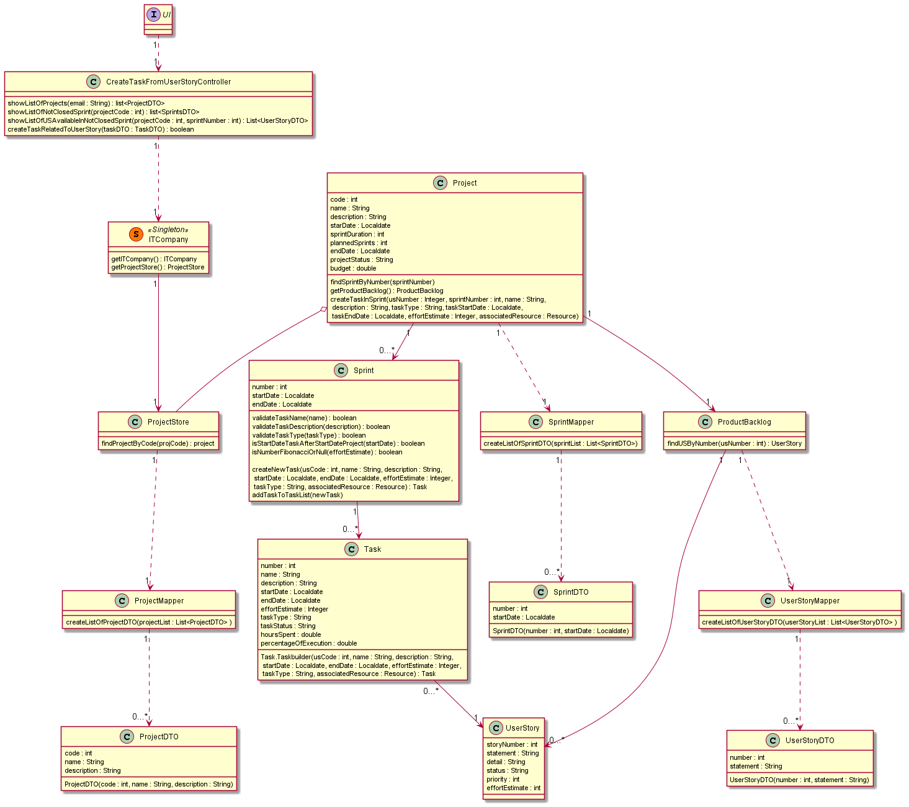

# US 031 - To create a Task inside a scope of a US

## 1. Requirements Engineering

### 1.1. User Story Description

- As Team Member, I want to create a task in a user story

### 1.2. Customer Specifications and Clarifications

**From the Product Owner clarifications:**
* Questão:
>Para além duma referência à UserStory a que pertence, quais serão as diferenças de uma task fora do âmbito da User Story e de uma que pertence a uma User Story?

* Resposta:
>Provavelmente nenhuma.

--//--

* Questão:
>Uma tarefa fora do contexto de user story estará sempre e apenas associada a um sprint? Ou poderá haver tasks associadas diretamente ao projeto?

* Resposta:
>Não há tasks fora do contexto de um sprint.

--//--

* Questão:
>O tipo de «task» deve ser selecionado a partir de uma lista (ex: Meeting, Documentation, Design, Implementation, Testing, Deployment,...)? Ou é uma descrição introduzida pelo ator?

* Resposta:
>Poderá ser interessante haver uma padronização por projeto, mas ainda não há user stories nesse sentido.

--//--

* Questão:
>Qual é a diferença entre os estados «Blocked» e «Finished» de uma «task»?

* Resposta:
>Normalmente, de blocked pode passar a running.
Eu diria que fazia sentido considerar ainda o estado "cancelled", mas ainda temos tempo para abordar esse assunto.

### 1.3. Acceptance Criteria

* **AC1:** The actor must participate in a Projects 
* **AC2:** The Project must have open Sprints with already set User Stories
* **AC3:** Input data must attend truthful validations, such as name cannot have length of 0 or over 100 characters;
description cannot have length of 0 or over 300 characters; task type must be one of those already predefined, the task 
startdate must be after the sprint statdate and the effort estimate must belong to the Fibonacci sequence; 
* **AC4:** The Task must not have duplicated inputs, specifically the name. So, in the existent lists of Tasks in Sprint 
there can't be any task with the same name as the one meant to be created

### 1.4. Found out Dependencies

* No dependencies found

### 1.5 Input and Output Data

**Input Data:**

* Selected data:
  * project Code
  * Sprint Code
  * UserStory Number
* Input Data Mandatory:
    * task Name
    * task Description
    * task Type
* Input Data Optional:
  * startDate
  * endDate
  * effort estimate
  * associated resource

**Output Data:**

* (In)Success of the operation - boolean

### 1.6. System Sequence Diagram (SSD)

## 2. OO Analysis

### 2.1. Relevant Domain Model Excerpt

## 3. Design - User Story Realization

### 3.1. Rationale

| Interaction ID | Question: Which class is responsible for... | Answer  | Justification (with patterns)  |
|:-------------  |:--------------------- |:------------|:---------------------------- |
|  Step 1  		 |	... interacting with the actor? | CreateTaskFromUserStoryUI   |  This class represents an Interface that interacts directly with actor           |
|       		 |	... instantiate dto? | CreateTaskFromUserStoryUI   |  Knows the input data.          |
|  Step 2	 	 |	... coordinating the US? | CreateTaskFromUserStoryController | Controller                             |
|  Step 3   	 |	... find the selected Project | ProjectStore   |  Knows all projects          |
|  Step 4        |	... find the selected Sprint | Project   |  Knows all Sprints          |
|  Step 5  		 |	... find the selected User Story | Product Backlog   |  Knows all UserStories          |
|  Step 6     	 |	... validate inputs necessary to create Task | Sprint   |  Knows all other tasks (prevents task repetition)          |
|       		 |	... generates task code | sprint |  Knows all Tasks          |
| 			  	 |	... create a new Task?			 | Sprint   | IE: knows all Accounts|
| Step 7  		 |	... informing operation success?| CreateTaskFromUserStoryUI   | is responsible for user interactions.  | 

### Systematization ##

According to the taken rationale, the conceptual classes promoted to software classes are:

* ProductBacklog
* UserStory
* Project
* Sprint
* Task

Other software classes (i.e. Pure Fabrication) identified:

* CreateTaskFromUserStoryUI
* CreateTaskFromUserStoryController
* ITCompany
* ProjectStore
* ProjectMapper
* ProjectDTO
* SprintMapper
* SprintDTO
* UserStoryMapper
* UserStoryDTO

## 3.2. Sequence Diagram (SD)

## 3.3. Class Diagram (CD)

