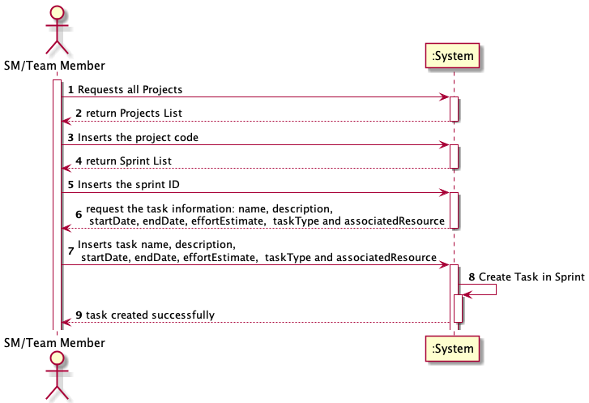
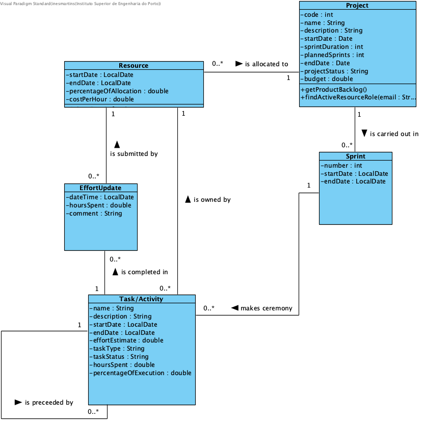
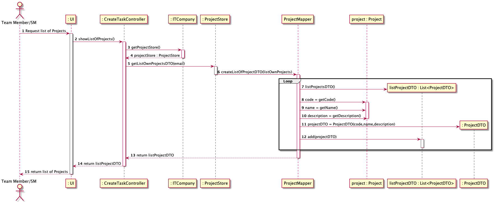
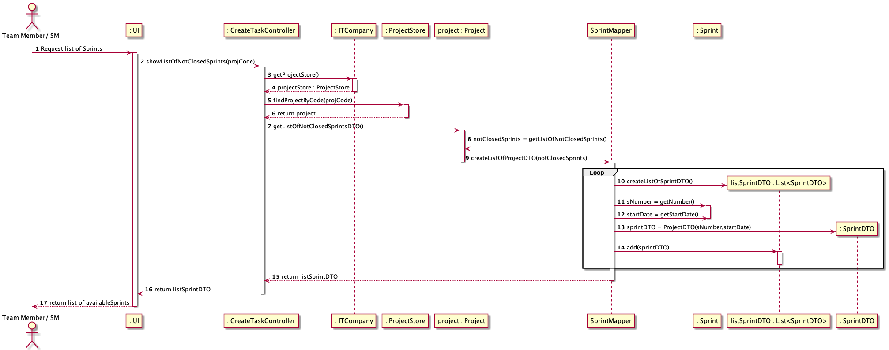
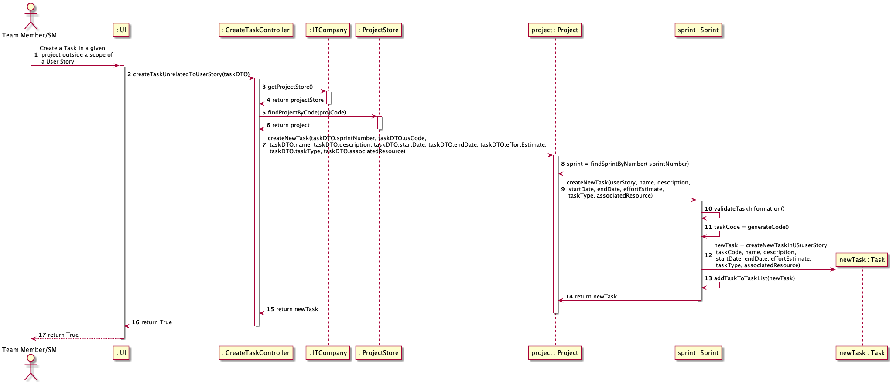
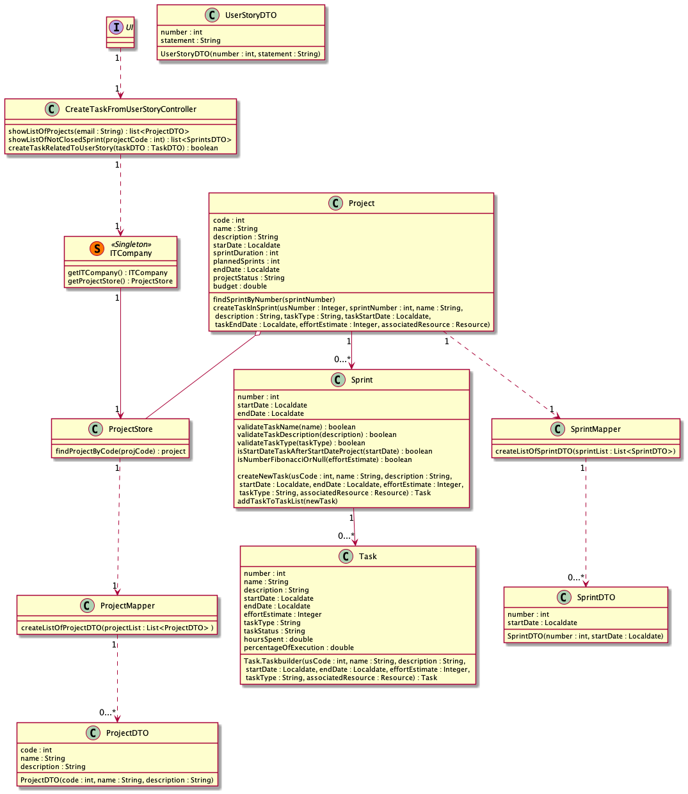

# US 032 - To create a Task outside a scope of a US

## 1. Requirements Engineering

### 1.1. User Story Description

- As SM/Team Member, I want to create task outside the scope of a user story

### 1.2. Customer Specifications and Clarifications

**From the specifications document:**
> "During the sprint, project team members register work done in these tasks." (p.4, l.5)
>"The creation of tasks is done by the team members. The users available for the activities are the team members, the PO and the SM." (p.4, l.36-37)

**From the Product Owner clarifications:**
* Questão:
>Para além duma referência à UserStory a que pertence, quais serão as diferenças de uma task fora do âmbito da User Story e de uma que pertence a uma User Story?

* Resposta:
>Provavelmente nenhuma.

--//--

* Questão:
>Uma tarefa fora do contexto de user story estará sempre e apenas associada a um sprint? Ou poderá haver tasks associadas diretamente ao projeto?

* Resposta:
>Não há tasks fora do contexto de um sprint.

--//--

* Questão:
>O tipo de «task» deve ser selecionado a partir de uma lista (ex: Meeting, Documentation, Design, Implementation, Testing, Deployment,...)? Ou é uma descrição introduzida pelo ator?

* Resposta:
>Poderá ser interessante haver uma padronização por projeto, mas ainda não há user stories nesse sentido.

--//--

* Questão:
>Qual é a diferença entre os estados «Blocked» e «Finished» de uma «task»?

* Resposta:
>Normalmente, de blocked pode passar a running.
Eu diria que fazia sentido considerar ainda o estado "cancelled", mas ainda temos tempo para abordar esse assunto.

### 1.3. Acceptance Criteria

* **AC1:** The actor must be inserted in a set of Projects
* **AC2:** Input data must attend truthful validations
* **AC3:** The Task must not have duplicated inputs such as name. So, in the existent lists of Tasks (in Project and Sprint
* ) there can't be any task with the same name as the one meant to be created

### 1.4. Found out Dependencies

* No dependencies found

### 1.5 Input and Output Data

**Input Data:**

* Selected data:
  * project Code
  * UserStory Number
  * task Name
  * task Description
  * task Start Date
  * task End Date
  * effort Estimate
  * task Type
  * associatedResource

**Output Data:**

* (In)Success of the operation

### 1.6. System Sequence Diagram (SSD)

## 2. OO Analysis

### 2.1. Relevant Domain Model Excerpt

## 3. Design - User Story Realization

### 3.1. Rationale

| Interaction ID | Question: Which class is responsible for... | Answer  | Justification (with patterns)  |
|:-------------  |:--------------------- |:------------|:---------------------------- |
| Step 1  		 |	... interacting with the actor? | UI   |  This class represents an Interface that interacts directly with actor           |
| 			  	 |	... coordinating the main action? | CreateTaskUnrelatedUserStory | Controller and PF                          |
| 			  	 |	... initiate the creation of the Task? | Sprint   | Creator: knows and validates the info related to task  |
| 			  	 |  ... show Projects' list on which the user is allocated to? | ITCompany  | PF and Singleton: knows all lists in the system  |
| 			  	 |  ... find the selected project? | ProjectStore  | PF and IE: contains all existing Projects  |
| 			  	 |	... find the available Sprints ? | Project   | IE: knows all available Sprints|
| 			  	 |	... creating the Task?						 | Sprint  | IE and Creator: knows all Tasks |
| Step 8  		 |	... informing operation success?| UI   | Interface: is responsible for user interactions.  | 

### Systematization ##

According to the taken rationale, the conceptual classes promoted to software classes are:

* Project
* Sprint
* Task

Other software classes (i.e. Pure Fabrication) identified:

* UI
* CreateTaskUnrelatedToUserStoryController
* ITCompany
* ProjectStore
* ProjectMapper
* ProjectDTO
* SprintMapper
* SprintDTO

## 3.2. Sequence Diagram (SD)

## 3.3. Class Diagram (CD)

# 4. Tests

**Test 1:** List All Projects the the Team member/SM is allocated to 

	  @Test
      void listOwnProjectsObject()

**Test 2:** Show List of all available Sprints

	  @Test
      void getListOfNotClosedSprints()

**Test 3:** Create New Task Success

	  @Test
      void createNewTask_True()

**Test 4:** Create New Task Failure
    
      @Test
      void createNewTask_False()

**Test 5:** Add Task to List of Tasks in Sprint

      @Test
      void addTaskToTaskList()

