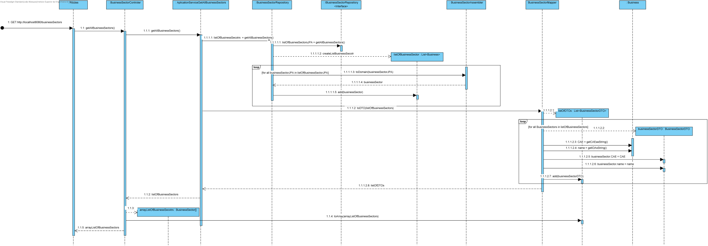
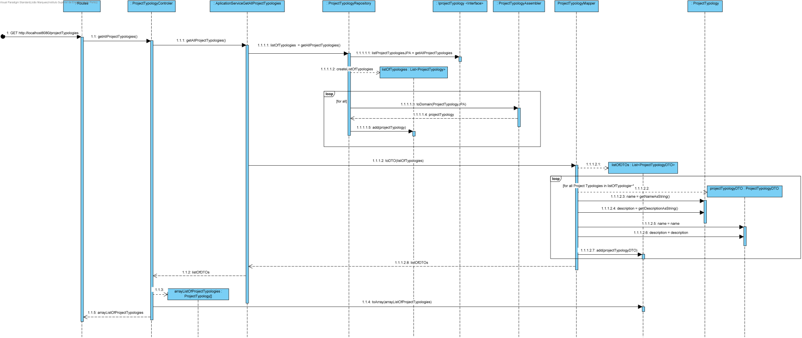

# US 5 - As a director, I want to create a project

## 1. Requirements Engineering

### 1.1. User Story Description

As a director, I want to create a project

### 1.2. Customer Specifications and Clarifications

* Upon creation, the project status should be 'Planned';
* Budget is only a number;
* End date and planned sprints don't have to be decided when creating a project;

### 1.3. Acceptance Criteria

* The chosen customer, business sector and project typology must already exist;
* Project name can't have symbols;
* Sprint duration and budget must be positive numbers;

### 1.4. Found out Dependencies

* Dependency found on US:012 - As a director, I want to create a new project Typology;
* Although it's not a User Story, this User Story is also dependent on having created a customer and a business sector;

### 1.5 Input and Output Data

**Input Data:**

* Typed data:
    * Name
    * Description
    * Start Date
    * Sprint Duration
    * Budget

* Selected data:
    * Project Typology
    * Business Sector
    * Customer
    
**Output Data:**

* (In)Success of operation

### 1.6. System Sequence Diagram (SSD)

### 1.7 Other Relevant Remarks

* n/a

## 2. OO Analysis

### 2.1. Relevant Domain Driven Design Model Excerpt

### 2.2. Use Case Diagram

## 3. Design - User Story Realization

##3.1. Process View Level 2

##3.2. Process View 3

## 3.3. Sequence Diagram (SD)

## 3.4. Class Diagram (CD)

# 6. Observations

n/a
