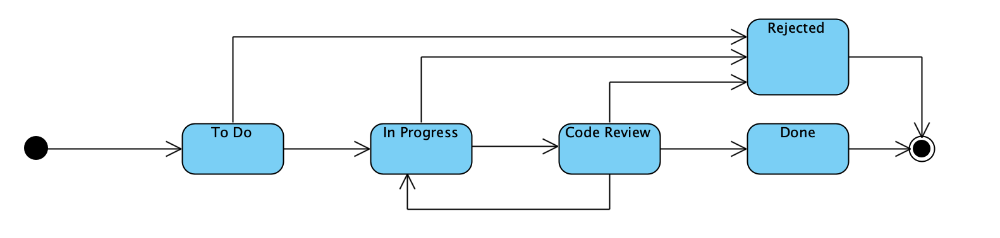

#US009
##Refactor to apply DDD, Onion Architecture and REST concepts

**Main changes applied by this refactoring**

* _US status attribute was dropped_

Besides the expected project structure change the new flows of information and navigability, there are some important 
transformations worth a note, regarding the implementation of this User Story. 

>US009 - As Product Owner, I want to create a user story and add it to the Product Backlog.

The status of the US can be modeled as follows:

The following US states are clearly identified by the respective Category in the ScrumBoard:
-To Do
-In Progress
-Code review
-Done
-Rejected

Considering that a US can be added to multiple Sprints (the requirements don't define any restriction to add a US to a Sprint,
for example an US that is "In Progress" in one Sprint can be added to other) and that we don't need to store a record of 
the states transitions during a Sprint (only the final states is needed) the team has decided that the ScrumBoard 
category is sufficient to identify a User Story status.
For example, if we want to understand if a User Story is any of the states above, the ScrumBoard is consulted. 
If we want to understand if a User Story is planned, we just need to verify if it is found in any Sprint. 
If we want to understand if a User Story is Decomposed, we just have to consult the boolean attribute "is Decomposed"
of the User Story. 

This simplification allows that, when adding a US to a Sprint Backlog, we don't have to alter both the aggregate User Story 
and  the aggregate Sprint, which simplifies a lot the code implementation. Only the aggregate Sprint is changed
when adding a US to a SprintBacklog. 

* _Effort estimate attribute was dropped_

The effort estimate of a User Story (US) is provided when the US is added to a Sprint Backlog.
Considering that the entity User Story and the Entity Sprint belong to different aggregates, this would mean that whenever
the effort is estimated, two aggregates would be changed:

-The US - the attribute effort estimate is updated

-The Sprint - a new entity SprintBacklogItem would be created

To avoid the simultaneous edit of two aggregates, it was decided to move the effort estimate attribute to the entity 
SprintBacklogItem. This brings another advantage, which is the fact that we can now store the effort estimate for each Sprint,
which is important because a US can be added to more than one Sprint and its effort is very likely to change from Sprint
to Sprint. 
The major impact of this change will be applied in US023.

* _The definition of the USID_

The Value Object (VO) User Story ID is a business ID, in other words, a user must be able to use the USID to 
identify the User Story. With that in mind, the user would identify a US by its number in a project.
In other words, a User Story has a unique number in a project.
Having said that, it was defined that the US Id would be a concatenation of the Project Number with the User Story number. 

* _The application of persistence mechanisms_
When initiating this Sprint, some progress was made regarding the application of a data persistence method (in this case JPA).
However, as progress was made, we also realized that we were lacking some basic conceps, such as creating methods to implement
SQL queries. 
Considering that JPA and H2 application was not requested for this sprint, we abandoned this approach, because we had to place
our major focus into REST.
Due to that, some java classes and tests are commented and instead lists were used at the level of the repositories. Also, 
some SDs already contemplate a description of the application of JPAs, even though these are for now commented and not fully tested. 
This also leads to the fact that we don't have (for now) interfaces for repositories, but that is the aim of the upcoming 
sprints.

**Testing REST controllers with Postman**
Considering that no Bootstrap has been implemented so far, in oder to test the controller from US023 (AddUSToSprinTbacklogController)
it is necessary to:
1. Create a project
2. Test the controller and use the project created in point 1 above. 
