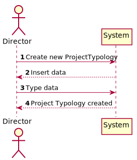
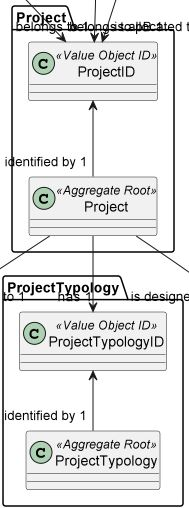
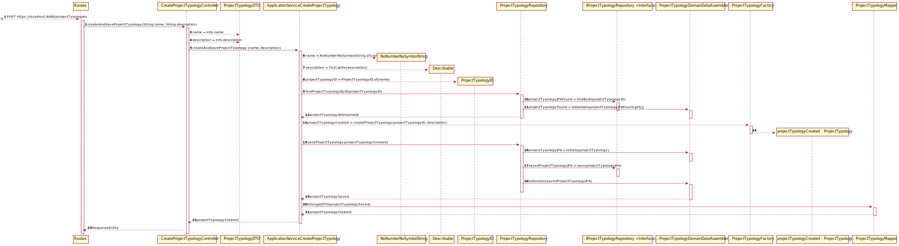
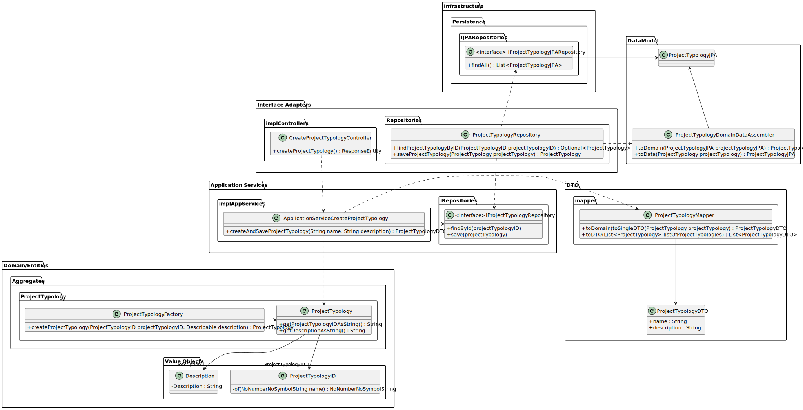

# US 24 - To list categories

## 1. Requirements Engineering

### 1.1. User Story Description

As Director, I want to create new project typology.

### 1.2. Customer Specifications and Clarifications

**From the specifications document:**

N/A

**From the client clarifications:**

N/A

### 1.3. Acceptance Criteria

* It isn't possible create a new project typology if it already exists

### 1.4. Found out Dependencies

* No dependencies were found. Project Typology is needed when new Project is created.

### 1.5 Input and Output Data

**Input Data:**

* Typed data:
    * Name
    * Description

* Selected data:
    * Got to Project Typology in navigate bar

**Output Data:**

* (In)Success of operation

### 1.6. System Sequence Diagram (SSD)

### 1.7 Other Relevant Remarks

* n/a

## 2. OO Analysis

### 2.1. Relevant Domain Driven Design Model Excerpt

### 2.2. Other Remarks

n/a

## 3. Design - User Story Realization

## 3.1. Sequence Diagram (SD)

## 3.2. Class Diagram (CD)

# 6. Observations

n/a

