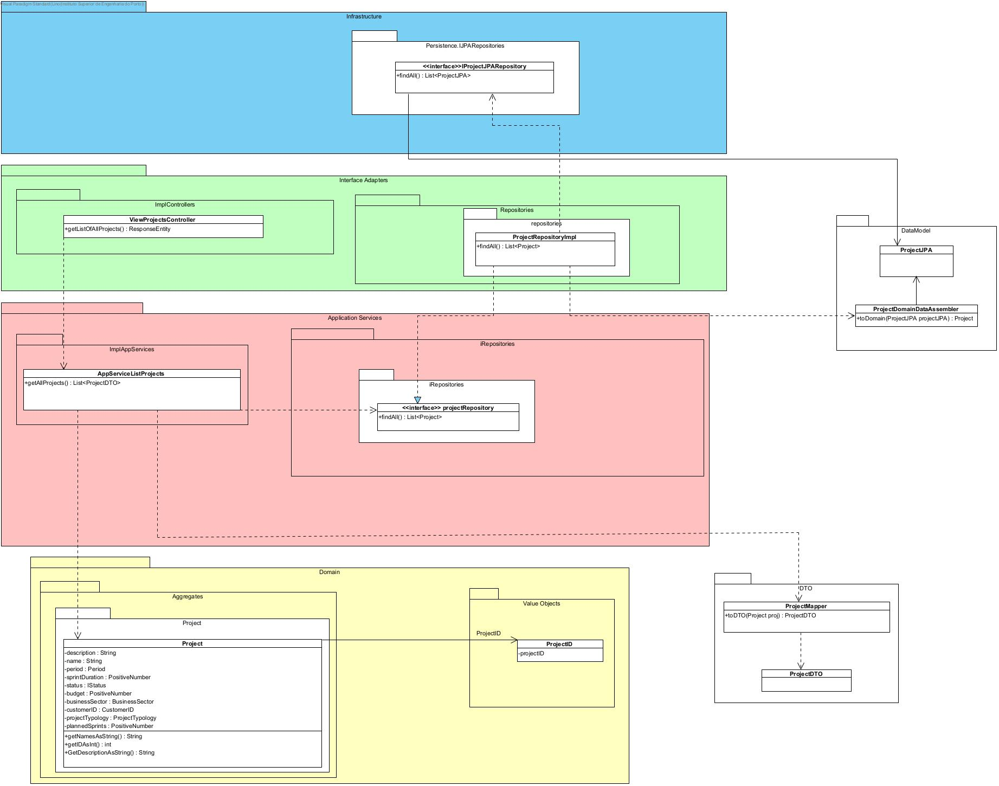

# US015 - List of all projects

## 1. Requirements Engineering

### 1.1. User Story Description

As Director, I want to get a list of all projects

### 1.2. Customer Specifications and Clarifications

**From the specifications document:**

N/A

**From the client clarifications:**

N/A

### 1.3. Acceptance Criteria

* N/A

### 1.4. Found out Dependencies

* No dependencies were found.

### 1.5 Input and Output Data

**Input Data:**

* Typed data:
    N/A

* Selected data:
    * Got to Project Management in navigate bar

**Output Data:**

* List of all projects

### 1.6. System Sequence Diagram (SSD)

### 1.7 Other Relevant Remarks

* n/a

## 2. OO Analysis

### 2.1. Relevant Domain Driven Design Model Excerpt

### 2.2. Other Remarks

n/a

## 3. Design - User Story Realization

## 3.1. Sequence Diagram (SD)

## 3.2. Class Diagram (CD)

# 6. Observations

n/a

#US0015 with External Services

**Important Decisions regarding consumption of external projects**

Regarding the consumption of external projects, we had to take care of the following requirements:
- Displaying projects from an external application
- Not allowing any further action rather than displaying these external projects
- Persistence/syncronization of data between applications is not necessary

To accomplish these requirements, we have taken the following actions:
- The ProjectDTO (this DTO is used to send information about a project to the fronted) attribute "code" has been refactored 
to a type String, so we could add the prefix "EXT_" to the projects coming from the external application. 
- This change ensures that the external projects never have the same ID as the internal ones, because the internal projects
have an ID of type integer. 
- By doing so, we also guarantee that it is not possible to change or perform other actions to external projects, 
because they will never be found in our internal repositories. 
- Considering that we have been told that it is not a good practice to add business logic to code sintax, we could have implemented
a better solution, like for example whenever we search for a project in our internal repositories, if it is not found, we would search
for it in the external repositories and if found, the frontend should return a message saying the project is external and nothing
can be done on that register. 
- However, one of the advantages of this approach, is that on the frontend the user can visually identify which projects are external and 
which ones are internal. 

It is also important to mention that our application is loaded with REST level 3 links, however, the external projects do not carry
this information, because no actions can be done on them. This is was implemented on the class ApplicationServiceListProjects and 
method ListAllProjects. 

Ideally, we would add only one link to the External projects, which would be one that could allow us to access the project details.
However, the group has decided not to implement this, due to lack of time. 

**Architecture of the implemented solution**
To get more details about the architecture of the implemented solution please check:
- Class diagram for US015 (it includes the interfaces and implementations of WebRepositories and RestRepositories)
- Implementation and logical view diagrams (level 4) of our application. 