#US016 - As Director/PM/PO/SM, I want to view status of activities in a project.

**Sprint 2 - Considering activities as User Stories Status**

## 1. Requirements Engineering

### 1.1. User Story Description

As Director/PM/PO/SM, I want to view status of activities in a project.
### 1.2. Customer Specifications and Clarifications

According to P.O., activities during this sprint means "User Story Status"

### 1.4. Found out Dependencies
- Must exist a Project in general data base system
* Dependency found on US:005 - As a director, I want to create a new project;

- Must exist a User Stories in  the Project
* Dependency found on US009 - As Product Owner, I want to create a user story and add it to the Product Backlog

- Must Have Sprints in order to have a more detailed status (except to "Not Yet Added to ANy Sprint" or "Is Decomposed")
* Dependency found US023 - As Team Member, I want to add a user story in the product backlog to the sprint 1 backlog.
* Dependency found US020 - As Product Owner, I want to refine a broad user story of the Product Backlog into
  30 more focused user stories.

####Refactor to apply DDD, Onion Architecture and REST concepts

**Main changes applied by this refactoring:**

This User Story is quite complex in code, while fetching the User Story status. This design appeared mostly 
due to the refactor occurred in US009. The main changes made in this had a strong inpact in
US status:
- The actual US status is described in Entity "SprintBacklogItem", so the attribute "status" in US was drop. Considering
we shouldn't have duplicated information in both aggregates (SprintBacklogItem belongs to Sprint Aggregate, and UserStory is the Aggregate 
root in User Story aggregate) due to conflitual actions when trying to make changes in both aggregates.
- By the rules of DDD, we should have a domain service to manipulate and fetch information from two different aggregates,
and this is crucial while performing this user Story
- The us status is highly dependent on Sprint, so as marked and already desribed in "US009.md":

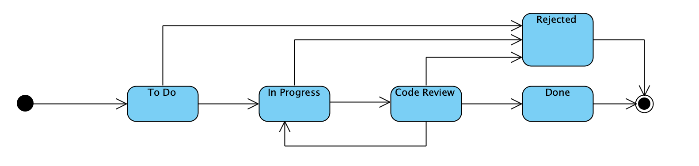

_**This means that our list contains, all User Stories of a project, aggregating Product Backlog list and including for:**_

  _-All user stories that are marked as decomposed (Status: "Decomposed User Story")_

  _-All user stories that are marked as DONE in its last Sprint_

  _-All user stories that are assigned to the currently running sprint_

* _The definition of the USID_

The Value Object (VO) User Story ID is a business ID, in other words, a user must be able to use the USID to
identify the User Story. With that in mind, the user would identify a US by its number in a project.
In other words, a User Story has a unique number in a project.
Having said that, it was defined that the US Id would be a concatenation of the Project Number with the User Story number.

### 1.5 Input and Output Data

**Input Data:**

* Project ID
   

**Output Data:**

* List with UserStory Status (success)
or
* Empty list

### 1.6. System Sequence Diagram (SSD)

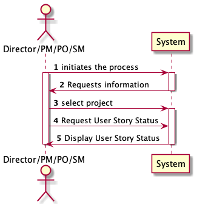

## 2. OO Analysis

### 2.1. Relevant Domain Driven Design Model Excerpt

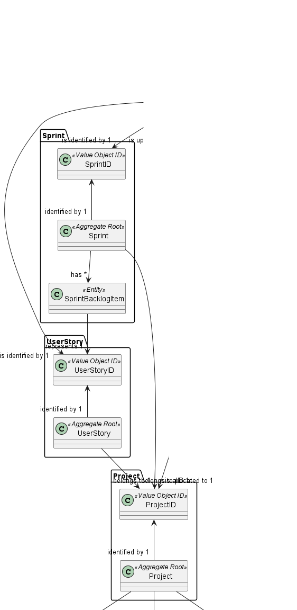

### 2.2. Use Case Diagram

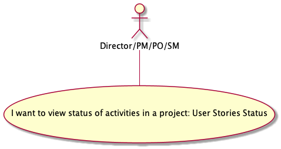

## 3. Design - User Story Realization

## 3.1. SD Level 2

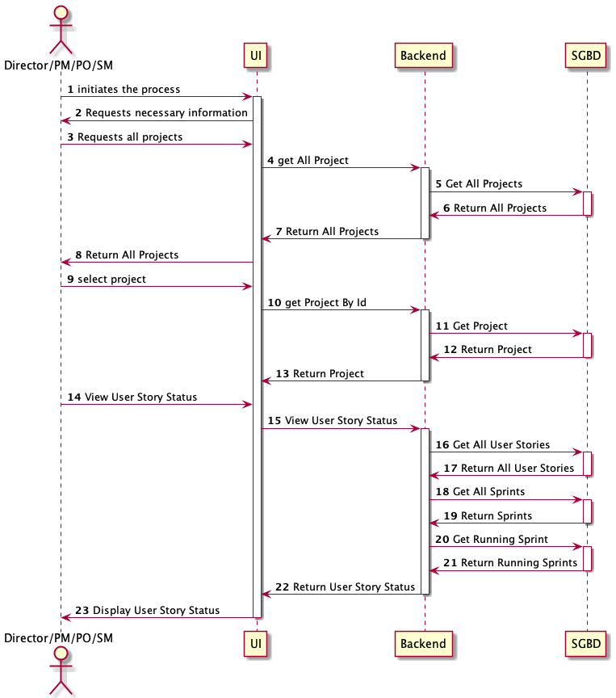

## 3.2. SD Level 3

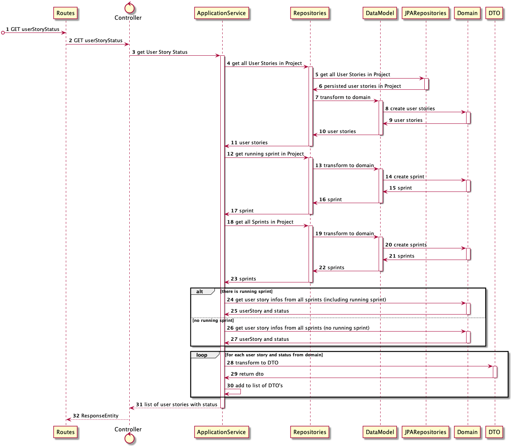

## 3.3. Sequence Diagram (SD)

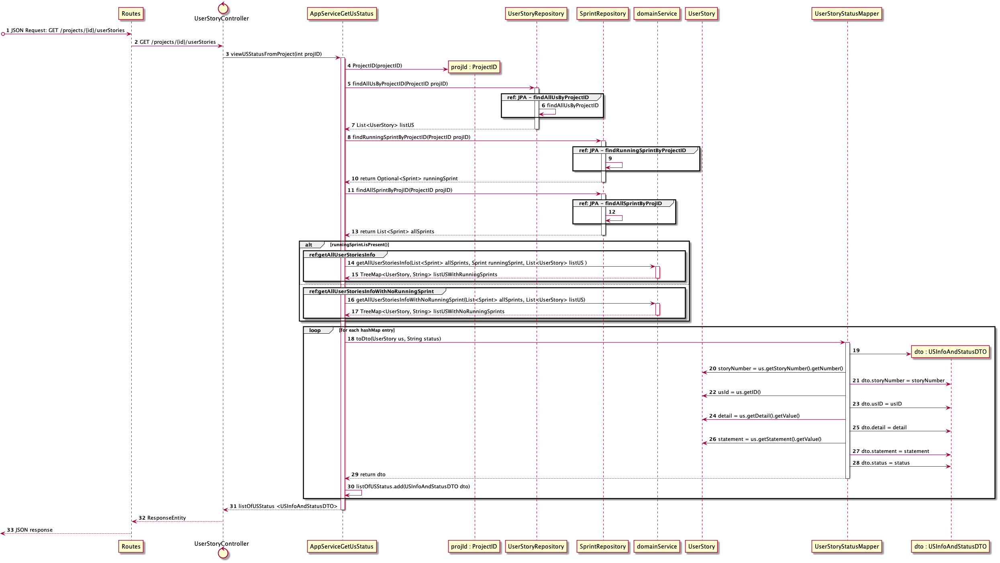

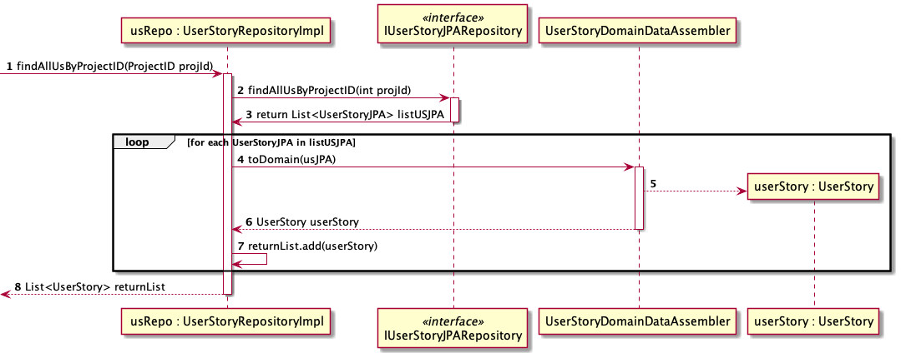

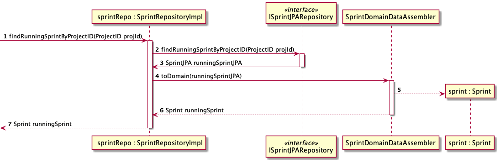

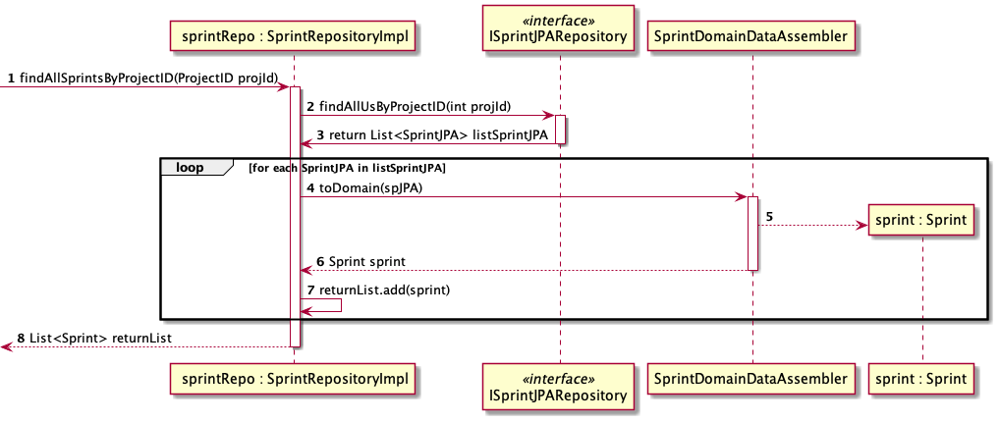

**Running Sprint**
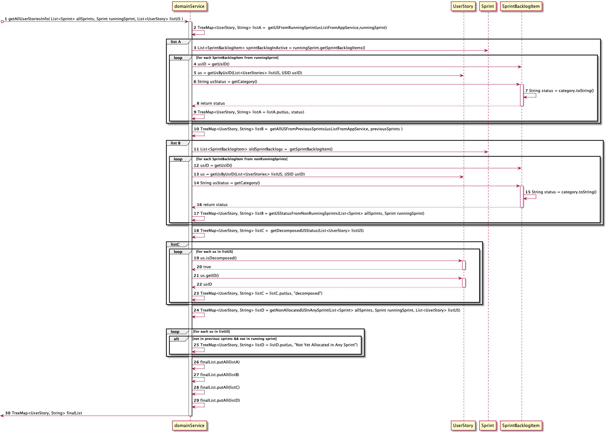

**No Runnign Sprint**
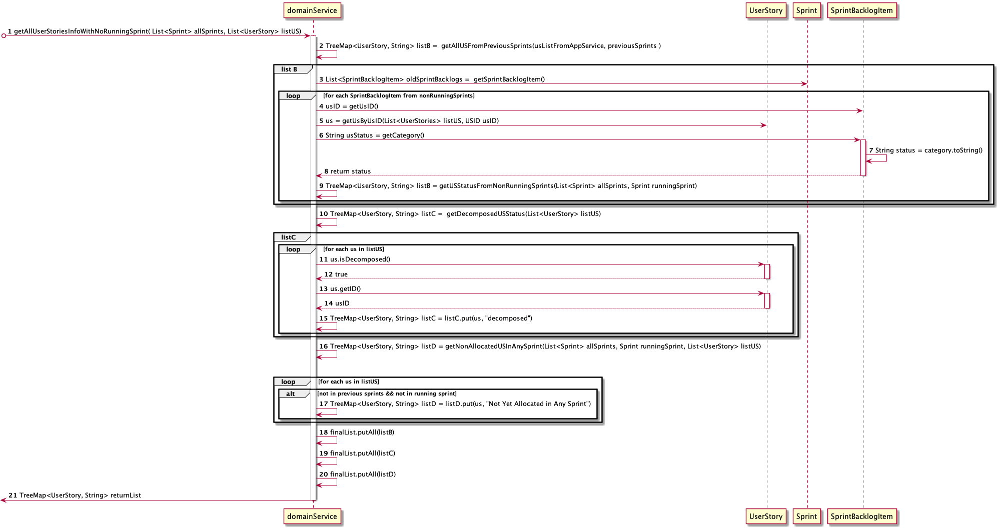

## 3.4. Class Diagram (CD)

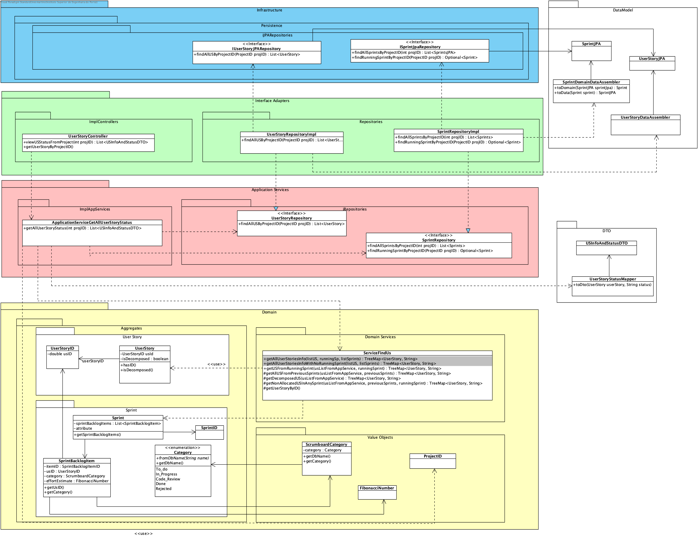
# 6. Observations

n/a

