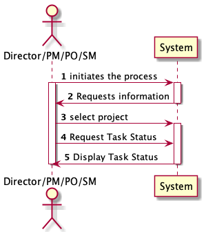
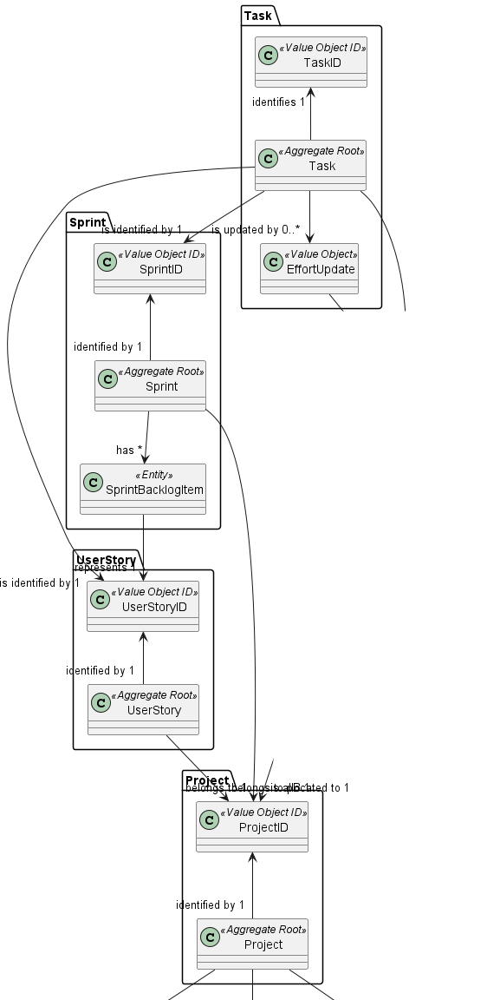
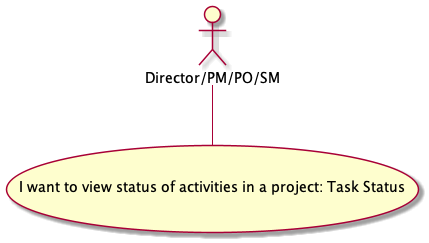
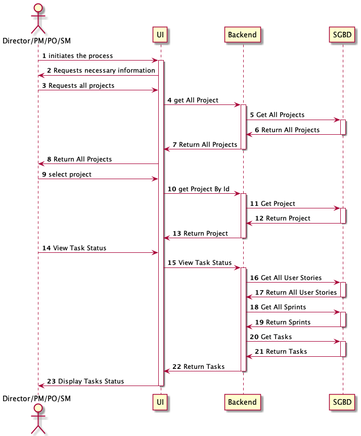
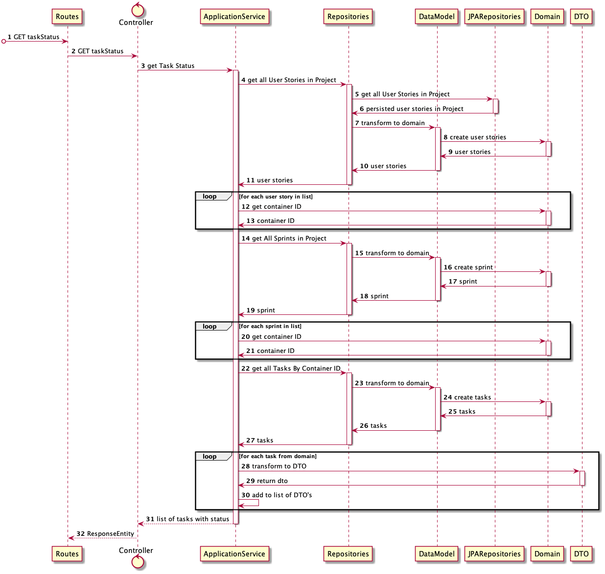
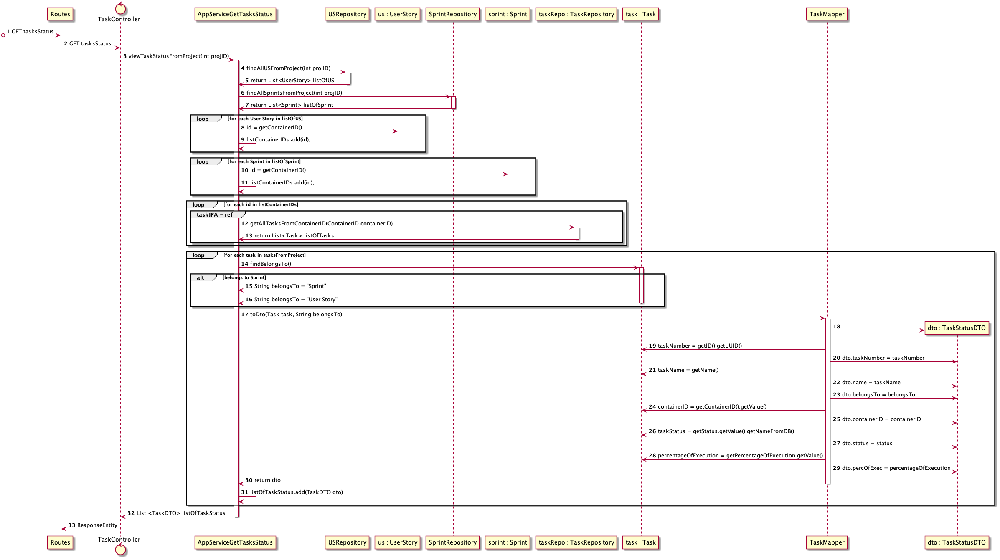
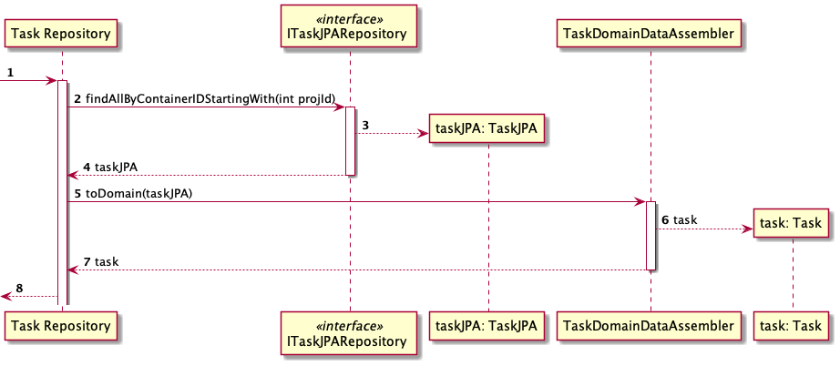
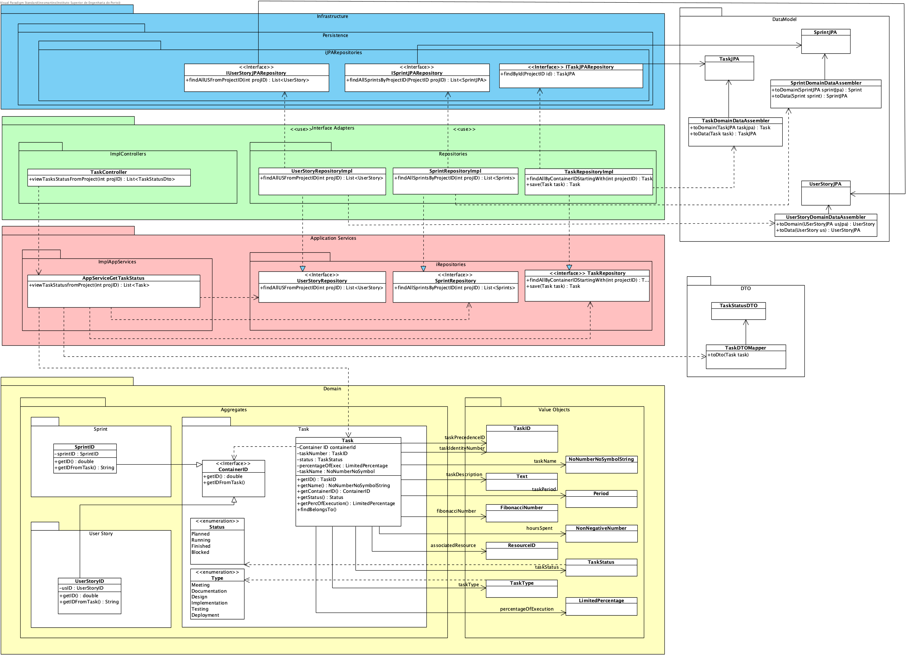

#US016 - As Director/PM/PO/SM, I want to view status of activities in a project.

**Sprint 3 - Considering activities as Task Status**

## 1. Requirements Engineering

### 1.1. User Story Description

As Director/PM/PO/SM, I want to view status of activities in a project.
### 1.2. Customer Specifications and Clarifications

According to P.O., activities during this sprint means "Tasks Status"

### 1.4. Found out Dependencies
- Must exist a Project in general data base system
* Dependency found on US:005 - As a director, I want to create a new project;

**These details regard tasks dependencies, since we can only have Tasks from Sprints and tasks from User Stories:**

- Must exist a User Stories in  the Project
* Dependency found on US009 - As Product Owner, I want to create a user story and add it to the Product Backlog

- Must Have Sprints
* Dependency found US023 - As Team Member, I want to add a user story in the product backlog to the sprint 1 backlog.
* Dependency found US020 - As Product Owner, I want to refine a broad user story of the Product Backlog into
  30 more focused user stories.

- Must Have Tasks Created
*Dependency found US031 -As Team Member, I want to create a task in a user story
*Dependency found US032 - As SM/Team Member, I want to create task outside the scope of a user story

### 1.5 Input and Output Data

**Input Data:**

* Project ID

**Output Data:**

* List with Tasks Status (success)
  or
* Empty list

### 1.6. System Sequence Diagram (SSD)

## 2. OO Analysis

### 2.1. Relevant Domain Driven Design Model Excerpt

### 2.2. Use Case Diagram

## 3. Design - User Story Realization

## 3.1. SD Level 2

## 3.2. SD Level 3

## 3.3. Sequence Diagram (SD)

## 3.4. Class Diagram (CD)

# 6. Observations

Comparing to US016a, the process engineering is not complex. The access to Task status is directly 
