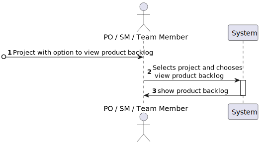

# US 018 - To list the product backlog

## 1. Requirements Engineering

### 1.1. User Story Description

As PO/SM/Team Member, I want to consult the product backlog, i.e. to get the list of user stories sorted by priority

### 1.2. Customer Specifications and Clarifications

**From the specifications document:**

> In scrum, the requirements of the project are expressed as user stories and the set of all user stories is the “project backlog”.

**From the client clarifications:**

> **No clarifications were asked for or given**

### 1.3. Acceptance Criteria

* AC01-1. Category code cannot be empty nor have less than five chars.
* AC01-2. Category description cannot be empty.

### 1.4. Found out Dependencies

* No dependencies were found

### 1.5 Input and Output Data

**Input Data:**

* Typed data:
    * n/a

* Selected data:
    * a project from a list of projects where the user has an active role in (returns an email and a project code to the system).

**Output Data:**

* Product backlog (list of user stories ordered by priority).

### 1.6. System Sequence Diagram (SSD)

### 1.7 Other Relevant Remarks

* The first part of this user story i.e. retrieval of user participating projects, is in fact US017.

## 2. OO Analysis

### 2.1. Relevant Domain Model Excerpt

### 2.2. Other Remarks

n/a

## 3. Design - User Story Realization

### 3.1. Rationale

| Interaction ID | Question: Which class is responsible for... | Answer  | Justification (with patterns)  |
|:-------------  |:--------------------- |:------------|:---------------------------- |
| Step 1  		 |	... interacting with the actor? | CreateCategoryView   |  Pure Fabrication: there is no reason to assign this responsibility to any existing class in the Domain Model.           |
| 			  		 |	... coordinating the US? | CreateCategoryController | Controller                             |
| 			  		 |	... instantiating a new Category? | Person   | Creator (Rule 1): in the DM Person maintains Category.   |
| 			  		 |	                                  | CategoryContainer   | By applying High Cohesion (HC) + Low Coupling (LC) on class Person, it delegates the responsibility on CategoryContainer.   |
| 			  		 | ... knows the CategoryContainer?   | Person  | IE: Person knows the CategoryContainer to which it is delegating some responsibilities.  |
| Step 2  		 |	... requesting data?				  | CreateCategoryView            |  IE: is responsible for user interactions.    |
| Step 3  		 |	... saving the inputted data? | Category  | IE: object created in step 1 has its own data.  | 
|      		     |	... validating all data (local validation)? | Category | IE: owns its data.| 
| 			  	 |	... validating all data (global validation)? | CategoryContainer | IE: knows all existing categories.|
| Step 4  		 |	... showing all data and request confirmation? | CreateCategoryView            |  IE: is responsible for user interactions.    |
| Step 5  		 |	... saving the created category?	 | CategoryContainer  | IE: knows all existing categories.|
| Step 6  		 |	... informing operation success?| CreateCategoryView  | IE: is responsible for user interactions.  | 

### Systematization ##

According to the taken rationale, the conceptual classes promoted to software classes are:

* Person
* Category

Other software classes (i.e. Pure Fabrication) identified:
* CreateCategoryView
* CreateCategoryController
* CategoryContainer

## 3.2. Sequence Diagram (SD)

**Alternative 1**

* Detected problems with this conceptual solution:
* The system is returning information not explicitly asked for i.e. the role the user has in the individual projects.
* The sequence diagram is not taking into account the use of US017 within US018.

**Alternative 2**

**Notice that:**

* The US flow is kept
* While creating a Category object, the constructor might check if it will be in a valid state or not. If not, it should fail
* "isValid" method was avoided
* "set" methods were completely avoided
* OO' best principles are being followed

As a result, the conceptual solution become easier to understand and maintain.

**You should adopt this approach.**

## 3.3. Class Diagram (CD)

**Note: private methods were omitted.**

# 4. Tests

Three relevant test scenarios are highlighted next.
Other test were also specified.

**Test 1:** Check that it is not possible to create an instance of the Category class with invalid values.

      TEST_F(CategoryFixture, CreateWithEmptyCode){
          EXPECT_THROW(new Category(L"",L"Category One"),std::invalid_argument);
      }

      TEST_F(CategoryFixture, CreateWithCodeHavingFourChars){
          EXPECT_THROW(new Category(L"C001",L"Category One"),std::invalid_argument);
      }

**Test 2:** Check that it is possible to create an instance of the Category class with valid values.

      TEST_F(CategoryFixture, CreateWithValidData){
          EXPECT_NO_THROW(new Category(L"C0001",L"Category One"));
      }

**Test 3:** Check that it is possible create and add/save a category on the container.

      TEST_F(CategoryContainerFixture, AddingOneCategory){
          EXPECT_TRUE(this->container->isEmpty());
          shared_ptr<Category> cat = this->container->create(L"C0019", L"Category 19");
          this->container->save(cat);
          EXPECT_FALSE(this->container->isEmpty());
      }

# 5. Integration and Demo

A menu option on the console application was added. Such option invokes the CreateCategoryView.

      int CategoriesMenuView::processMenuOption(int option) {
          int result = 0;
          BaseView * view;
          switch (option) {
          
            case 1:
              view = new CreateCategoryView(this->userToken);
              view->show();
              break;
            ...
          }
          return result;
      }

# 6. Observations

n/a

