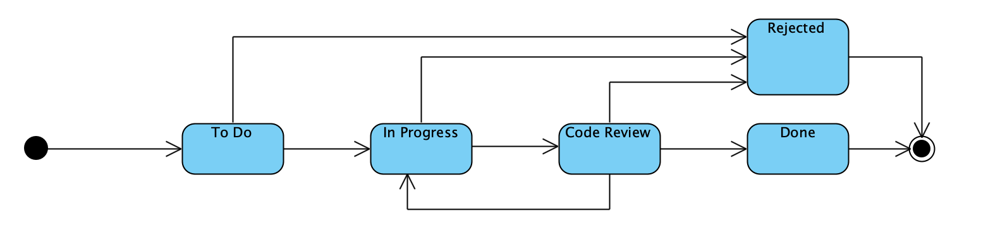

#US0023 - As Team Member, I want to add a user story in the product backlog to the sprint backlog.
##Refactor to apply DDD, Onion Architecture and REST concepts

**Main changes applied by this refactoring**

* _Design decisions and their effort on other User Stories_
The Design of US023 is heavily connected with the design of:
1. US018 - As PO/SM/Team Member, I want to consult the product backlog, i.e. to get the list of  user stories sorted by priority.
2. US019 - As Team Member, I want to estimate the effort of a user story.
3. US020 - As Product Owner, I want to refine a broad user story of the Product Backlog into more focused user stories.
4. US021 - As Product Owner, I want to change the priority of a user story in the product backlog.

The initial design of these user stories, used the priority of a US to determine whether it was part of the Product Backlog.
User Stories that were added to a Sprint or decomposed, were marked with priority 0. This meant that they could not be added
to another Sprint and that they were somewhat "removed" from the Product Backlog.

However, that that DDD is being applied, the act of adding a US to a Sprint and then updating its priority would mean 
that two aggregates would be manipulated within the same transaction - this may represent a concurrency problem and 
it must be avoided. 

After discussion with the team, it was decided that the best solution would be to not update the User Story priority when
it is added to the Sprint Backlog.
This means that the Product Backlog contains, from now on, all User Stories of a project except for:
-All user stories that are marked as decomposed (these can not be added to a Sprint Backlog and must be disregarded)
-All user stories that are marked as DONE in its last Sprint
-All user stories that are assigned to the currently running sprint

What is the impact of dependent US design?
1. US018 -    The rules above will be applied to US018, which consists in obtaining the product sorted by priority.
   Even though US019, US020, US021 and US023 rely on US018 to present a list of User Stories to the user starting the transaction,
   US018 will only be implemented later, once the JPA implementation is done, as it will facilitate the execution of queries in the
   database and consequently its implementation.
2. US019 - The estimation of the User Story effort won't trigger a priority update.
3. US020 - The decomposition of a User Story won't trigger a priority update.
4. US021 - Changing the priority of a US, will imply a trickier approach, described in US021 documentation. The concept of "ephemeral"
priority will be used to represent the priority shown to the user, even though only the "real" priority is stored in the object.
It means that the product backlog will be sorted by real priority (for example: 1, 5, 7, 8, 9) but the user will only see the "ephemeral"
priority (1, 2, 3, 4, 5). Then the user will be able to change this ephemeral priority and that change will later be reflected in
the "real" priority. 
5. US023 - **Some of the validations done when adding a US to the SprintBacklog won't be needed anymore, because the user is already
presented with a list of valid User Stories, i.e., User Stories that can be added to the Sprint Backlog. Those are:**
- US is not repeated
- Effort estimate is fibonacci number

Information updates that are no longer needed:
- US status
- US priority

**The concept of SprintBacklogItemID**

After discussion within the team, it was decided to use a random number to identify the Entity SprintBacklogItem.
This decision is justified by the fact that the concept of SprintBacklogItem is a "pure fabrication" and its ID has no
business logic attached.
In other words, the user knows that a US can be added to a Sprint, but this doesnt represent a proper business concept.

**The category transitions of the US in the ScrumBoard**

For more details on how these categories were defined, please consult the md file of US009. 

**Testing REST controllers with Postman**
Considering that no Bootstrap has been implemented so far, in oder to test the controller from US023 (AddUSToSprinTbacklogController)
it is necessary to:
1. Create a project
2. Create a US for that project
3. Create a Sprint for that project
4. Test the controller and use the project, US and Sprint created in points 1, 2 and 3 above. 

**The persistence of the SprintBacklogItem class**
In the backend, adding a US to a Sprint means that we actually create a new SprintBacklogItem, which contains an indentifier of the
Sprint, of the US, the effort estimated and the category of the US in the ScrumBoard. 
Note that Sprint and SprintBacklogItem are both entities and both belong to the same aggregate.
The class Sprint is the root of that aggregate. Having said so, only the Sprint has a repository.
So, whenever we create a new SprintBacklogItem and when we add it to the list of items in the Sprint, we also have to update the 
persisted Sprint object (because there is one more object in its list of items) and to create a new SprintBacklogItem persisted object.
For that purpose, the method under the class Sprint (addUStoSpringBacklog) updates the Sprint Domain object (its list of items)
and the applicationServiceAddUsToSprintBacklog calls the method "save" from the SprintRepo. In its turn, the SprintRepo will 
update the Sprint record by converting it from a domain entity to a persisted entity. In this process, a new Sprint JPA and
SprintBacklogItem JPAs will be generated and persisted. The Sprint JPA will contain a list of SprintBacklogItemJPAs, using 
a foreign key, as indicated in their respective classes. 
