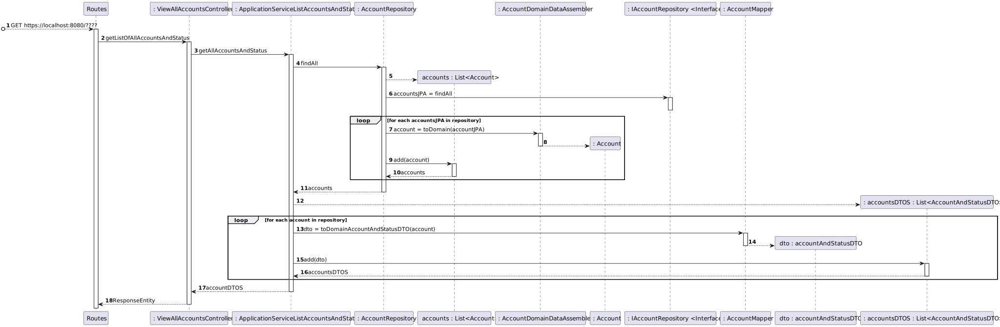

# US 24 - To list categories

## 1. Requirements Engineering

### 1.1. User Story Description

As Administrator, I want to get a list all user accounts and their status.

### 1.2. Customer Specifications and Clarifications

**From the specifications document:**

> When you create a new record, your "active" is created as inactive (boolean false). At the same time an 
> e-mail message is sent to the user that will allow them to activate the account, through a code 
> or an automatic activation link.

**From the client clarifications:**

> **Question:** The list has to contain only email and status (active/inactive)?
>
> **Answer:** "Email and status are enough, for now."

### 1.3. Acceptance Criteria

* Not-Provided
* No implicit AC were found

### 1.4. Found out Dependencies

* No dependencies were found.

### 1.5 Input and Output Data

**Input Data:**

* Typed data:
    * n/a

* Selected data:
  * Go to navigate bar and select Account -> All Accounts

**Output Data:**

* Emails and status of all accounts.

### 1.6. System Sequence Diagram (SSD)

### 1.7 Other Relevant Remarks

* n/a

## 2. OO Analysis

### 2.1. Relevant Domain Driven Design Model Excerpt

### 2.2. Other Remarks

n/a

## 3. Design - User Story Realization

## 3.1. Sequence Diagram (SD)

## 3.2. Class Diagram (CD)

# 4. Observations

n/a

