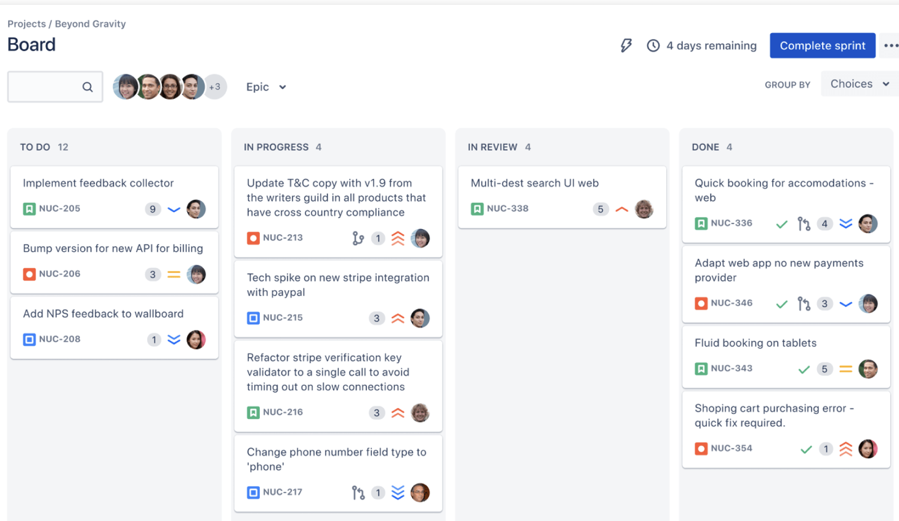

#US030 - As Team Member, I want to view the Scrum Board of current sprint.
##Refactor to apply DDD, Onion Architecture and REST concepts

**What is a ScrumBoard?**
We would like to point out that our group has
defined the ScrumBoard as being something very similar to what is presented by JIRA:

(source: https://www.atlassian.com/br/software/jira/features/scrum-boards)

Having this in mind, we defined the following Scrum Board Categories, which can be seen as User Stories status:

They have been represented in an SMD, because the progression between categories has rules defined by Scrum. 
US034 implements into more detail this possible transitions, while US030 will simply retrieve the information of the ScrumBoard. 

**Assumptions Made**
We have assumed that we want to display, as part of the ScrumBoard, the User Stories, with their number
and organized by status (aka ScrumBoard category), that are present in the sprint backlog of the sprint currently running. 
For that purpose, we have reused a method that had already been built for US016: serviceFindUS.getUSFromRunningSprint.
This method returns all the User Stories present in a running sprint and their status, which is exactly what we need 
for our ScrumBoard. 

**DDD design** 
Please refer to the markdown files of US009 and US023 where you can find some justifications of the DDD chosen for these
user stories, which also applies to US030. This includes an explanation about the concept of SprintBacklogItem, the reason why we 
need two different aggregates for User Stories and Sprints and some more details. 

