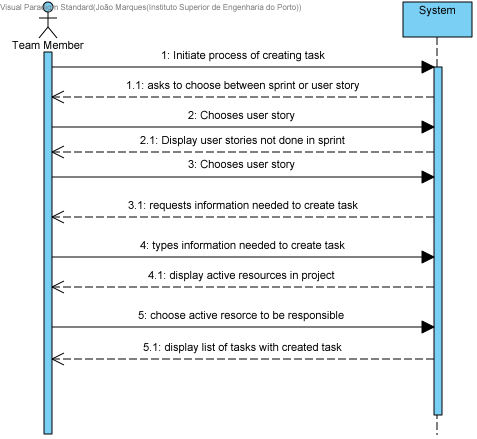
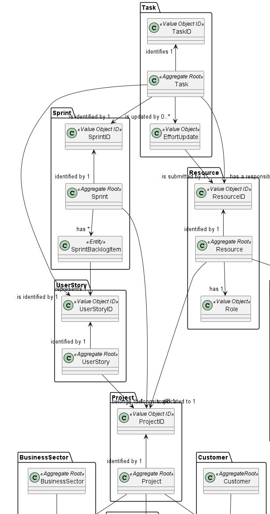
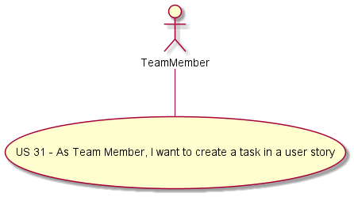
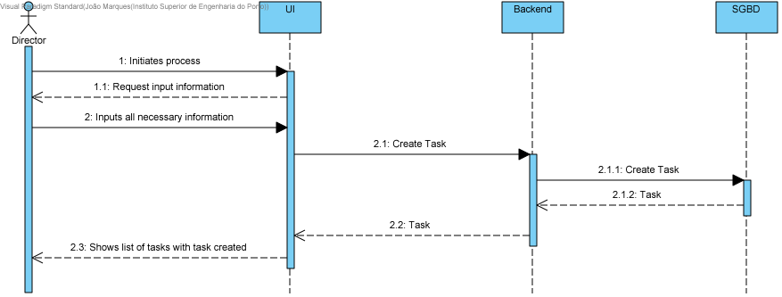
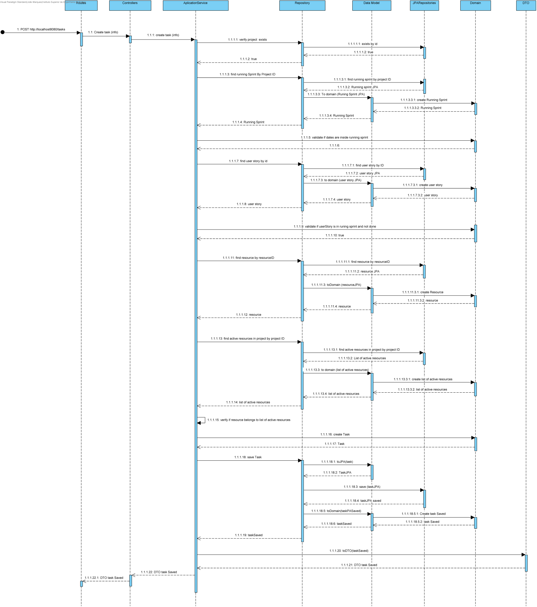
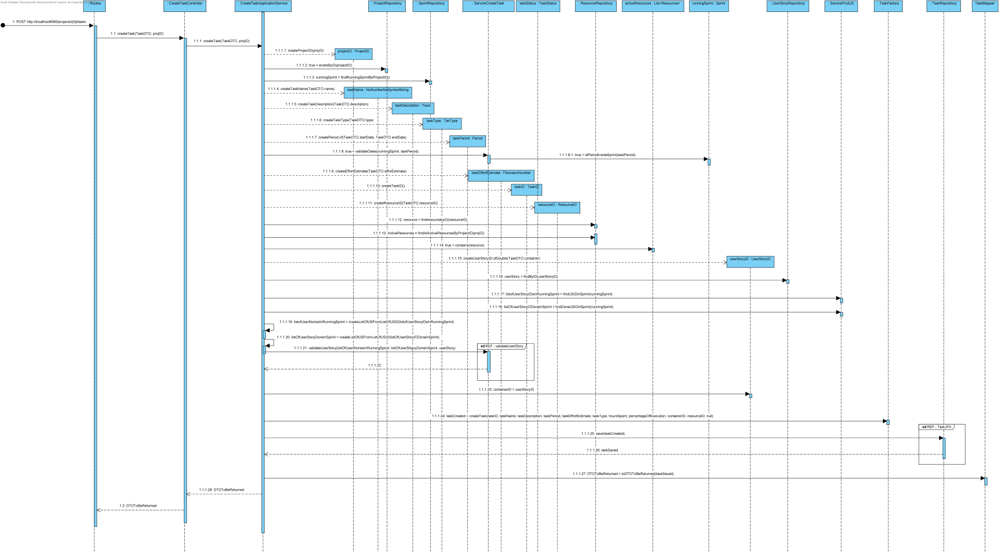
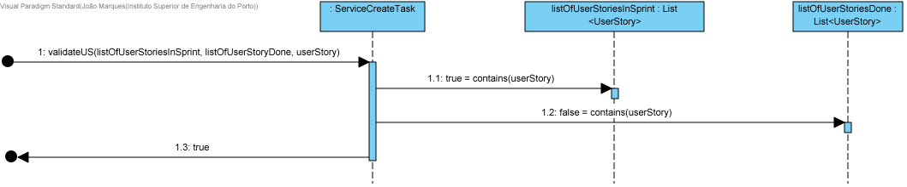
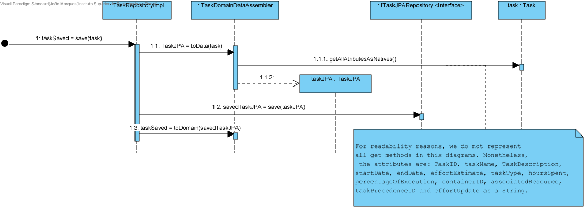
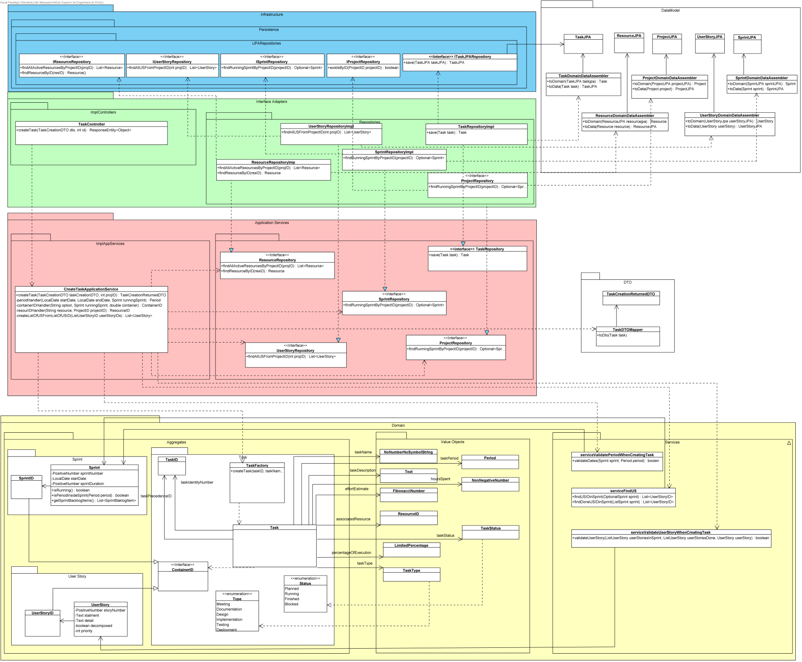

# US 31 - As Team Member, I want to create a task in a user story

## 1. Requirements Engineering

### 1.1. User Story Description

As Team Member, I want to create a task in a user story

### 1.2. Customer Specifications and Clarifications

* A task cannot exist outside the scope of a sprint;
* You can only crate tasks for the user stories not done in the current running sprint;
* When created, task status must be planned;
* Start date, end date, effort estimate and responsible are optional attributes upon task creating;
* Hours spent and percentage of execution are 0 upon creation.

### 1.3. Acceptance Criteria

* The resource responsible for the task must be an active one;
* Task name can't have symbols;
* Task start and end date must be inside running sprint start and end date;
* Effort estimate must belong to the Fibonacci sequence;

### 1.4. Found out Dependencies

* Dependency found on US:005 - As a director, I want to create a new project;
* Dependency found on US009 - As Product Owner, I want to create a user story and add it to the Product Backlog
* Dependency found US023 - As Team Member, I want to add a user story in the product backlog to the sprint 1 backlog.
* Dependency found on US022 - As Project Manager, I want to create a sprint.
* Dependency founf on US007 - As Director, I want to associate a human resource (user) to a project.

### 1.5 Input and Output Data

**Input Data:**

* Typed data:
    * Mandatory:
        * Name
        * Description
    * Optional:
        * Start Date
        * End Date
        
* Selected data:
    * Mandatory:
        * User Story
        * Type
    * Optional:
      * Effort Estimate
      * Resource Responsible

  
**Output Data:**

* (In)Success of operation

### 1.6. System Sequence Diagram (SSD)

### 1.7 Other Relevant Remarks

* n/a

## 2. OO Analysis

### 2.1. Relevant Domain Driven Design Model Excerpt

### 2.2. Use Case Diagram

## 3. Design - User Story Realization

## 3.1. SD Level 2

## 3.2. SD Level 3

## 3.3. Sequence Diagram (SD)

## 3.4. Class Diagram (CD)

# 6. Observations

n/a
